# babel AST

AST 也是有标准的，JS parser 的 AST 大多是 [estree 标准](https://github.com/estree/estree)


## 常见的AST节点

AST 是对源码的抽象，字面量、标识符、表达式、语句、模块语法、class 语法都有各自的 AST。我们分别来了解一下：

### Literal

Literal 是字面量的意思，比如 `let name = 'guang'`中，`'guang'` 就是一个字符串字面量 StringLiteral，相应的还有数字字面量 NumericLiteral，布尔字面量 BooleanLiteral，字符串字面量 StringLiteral，正则表达式字面量 RegExpLiteral 等。

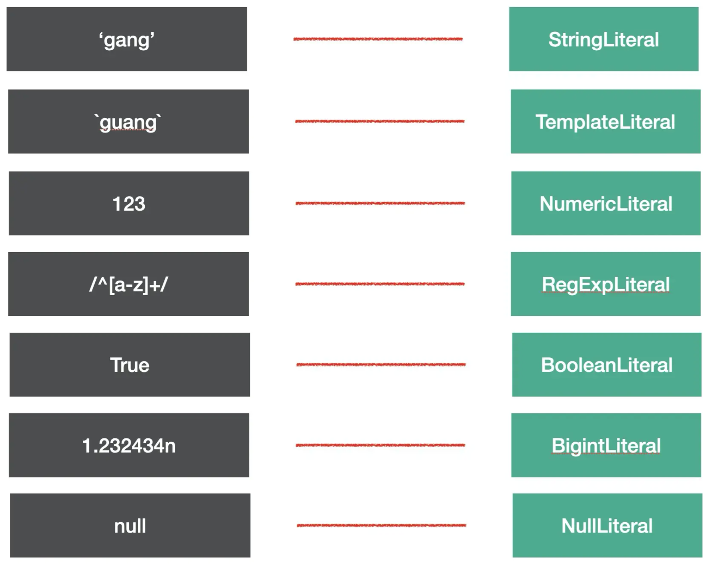 

代码中的字面量很多，babel 就是通过 xxLiteral 来抽象这部分内容的。

### Identifier

Identifer 是标识符的意思，变量名、属性名、参数名等各种声明和引用的名字，都是Identifer。我们知道，JS 中的标识符只能包含字母或数字或下划线（“_”）或美元符号（“$”），且不能以数字开头。这是 Identifier 的词法特点。

来尝试分析一下，下面这一段代码里面有多少 Identifier 呢？

```js
const name = 'guang';

function say(name) {
  console.log(name);
}

const obj = {
  name: 'guang'
}
```

下面被标注的都为 Identifier

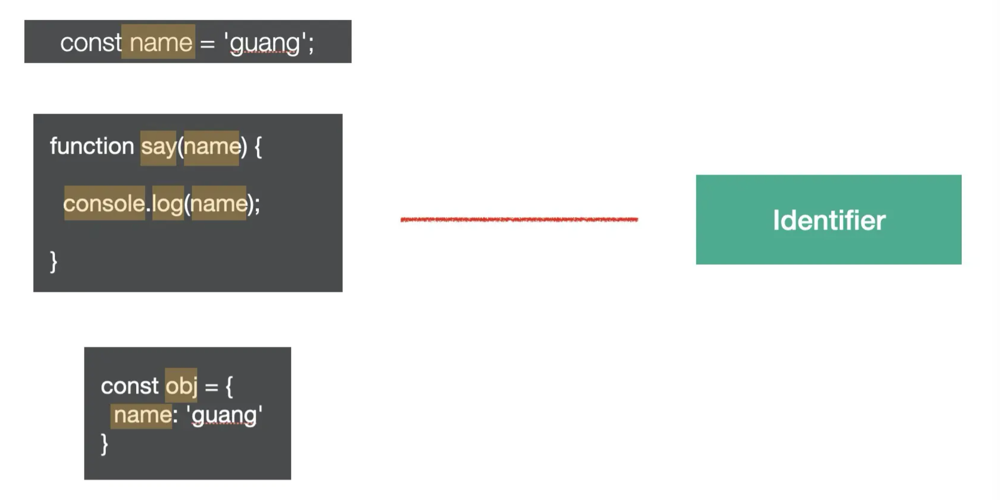 


### Statement

statement 是语句，它是可以独立执行的单位，比如 `break`、`continue`、`debugger`、`return` 或者 `if` 语句、`while` 语句、`for` 语句，还有声明语句，表达式语句等。我们写的每一条可以独立执行的代码都是语句。

语句末尾一般会加一个分号分隔，或者用换行分隔。

下面这些我们经常写的代码，每一行都是一个 Statement：

```js
break;
continue;
return;
debugger;
throw Error();
{}
try {} catch(e) {} finally{}
for (let key in obj) {}
for (let i = 0;i < 10;i ++) {}
while (true) {}
do {} while (true)
switch (v){case 1: break;default:;}
label: console.log();
with (a){}
```

它们对应的 AST 节点如下图所示：

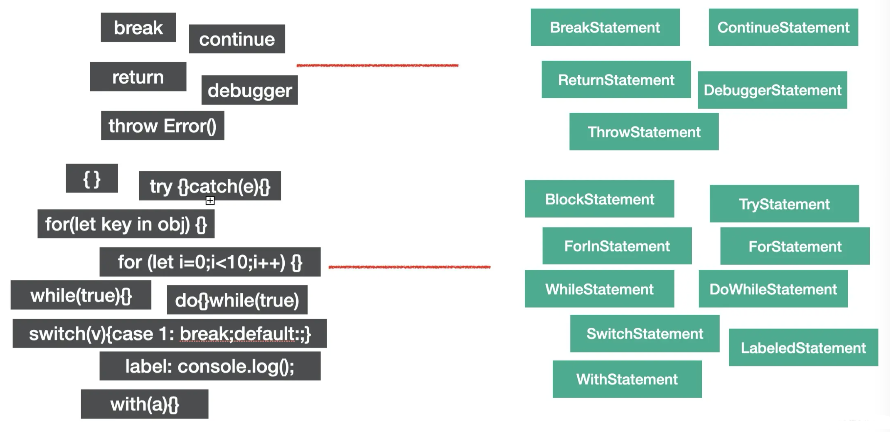 

语句是代码执行的最小单位，可以说，代码是由语句（Statement）构成的。

### Declaration

声明语句是一种特殊的语句，它执行的逻辑是在作用域内声明一个变量、函数、class、import、export 等。

比如下面这些语句都是声明语句：

```js
const a = 1;
function b(){}
class C {}

import d from 'e';

export default e = 1;
export {e};
export * from 'e';
```

它们对应的 AST 节点如下图：

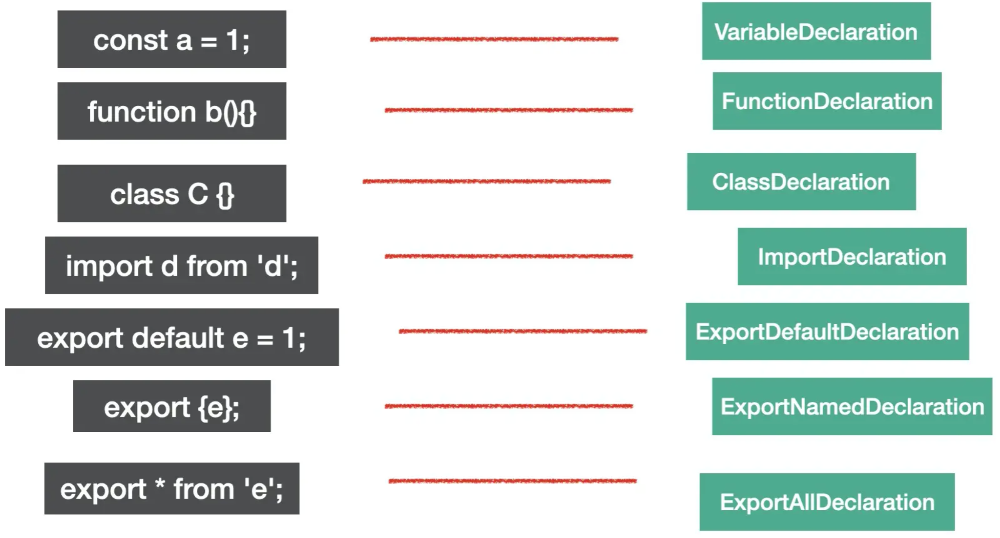 

声明语句用于定义变量，这也是代码中一个基础组成部分。

### Expression

expression 是表达式，特点是执行完以后有返回值，这是和语句 (statement) 的区别。

下面是一些常见的表达式

```js
[1,2,3]
a = 1
1 + 2;
-1;
function(){};
() => {};
class{};
a;
this;
super;
a::b;
```

它们对应的 AST 如图：

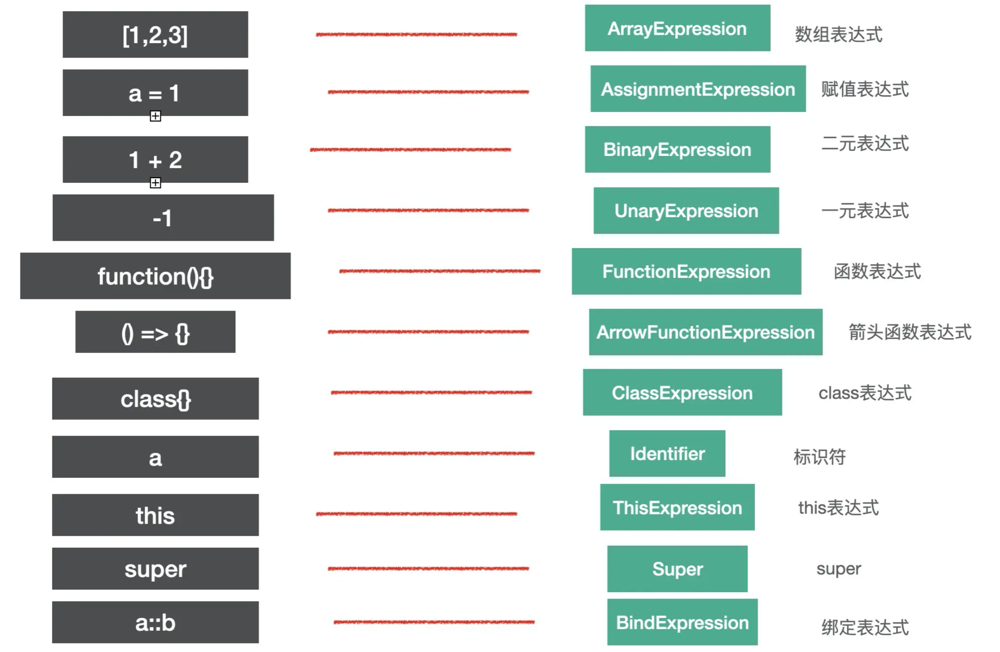 

:::tip
我们判断 AST 节点是不是某种类型要看它是不是符合该种类型的特点，比如语句的特点是能够单独执行，表达式的特点是有返回值。
:::

有的表达式可以单独执行，符合语句的特点，所以也是语句，比如赋值表达式、数组表达式等，但有的表达式不能单独执行，需要和其他类型的节点组合在一起构成语句。比如匿名函数表达式和匿名 class 表达式单独执行会**报错**：

```js
function(){};
class{}
```

需要和其他部分一起构成一条语句，比如组成赋值语句

```js
a = function() {}
b = class{}
```

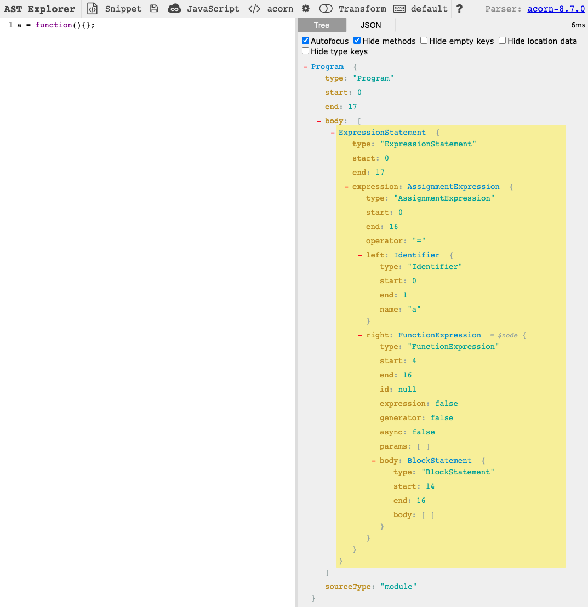 

表达式作为语句执行的时候，你会发现解析出的 AST 包裹了一层 ExpressionStatement 节点，代表这个表达式是被当成语句执行的。

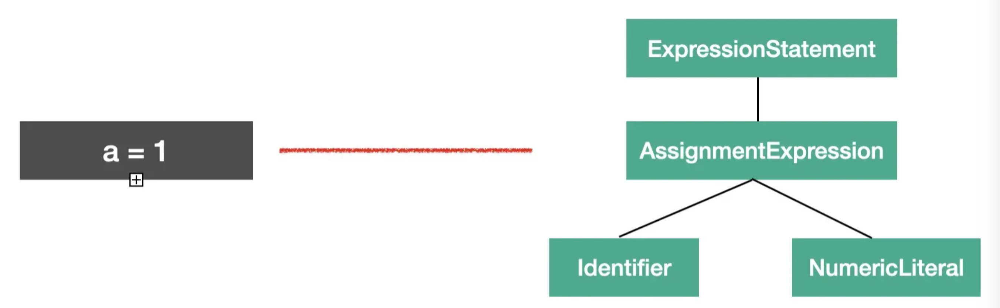 

### Class

class 的语法也有专门的 AST 节点来表示。

整个 class 的内容是 ClassBody，属性是 ClassProperty，方法是ClassMethod（通过 kind 属性来区分是 constructor 还是 method）。

比如下面的代码

```js
class Guang extends Person{
    name = 'guang';
    constructor() {}
    eat() {}
}
```

对应的AST是这样的

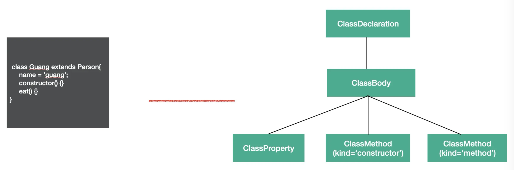 

详细：

 

class 是 es next 的语法，babel 中有专门的 AST 来表示它的内容。

### Modules

es module 是语法级别的模块规范，所以也有专门的 AST 节点。

### import

import 有 3 种语法：

```js
// 1. named import
import {c, d} from 'c';

// 2. default import
import a from 'a';

// 3. namespaced import
import * as b from 'b';
```

这 3 种语法都对应 `ImportDeclaration` 节点，但是 `specifiers` 属性不同，分别对应 `ImportSpicifier`、`ImportDefaultSpecifier`、`ImportNamespaceSpcifier`。

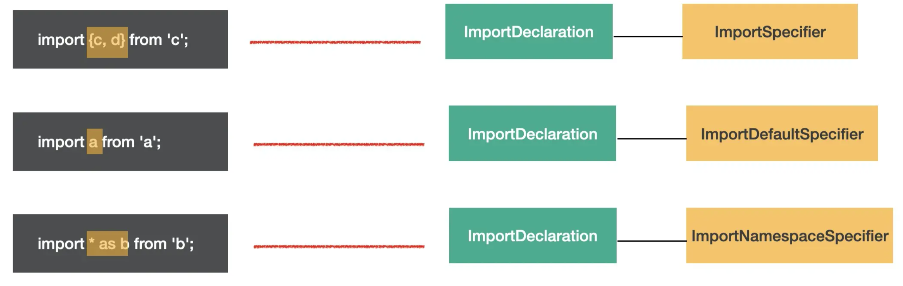 

图中黄框标出的就是 specifier 部分。可以直观的看出整体结构相同，只是 specifier 部分不同，所以 import 语法的 AST 的结构是 ImportDeclaration 包含着各种 import specifier。

### export

export 也有3种语法：

```js
// 1. named export：
export { b, d};

// 2. default export：
export default a;

// 3. all export：
export * from 'c';
```
分别对应 ExportNamedDeclaration、ExportDefaultDeclaration、ExportAllDeclaration 的 AST。

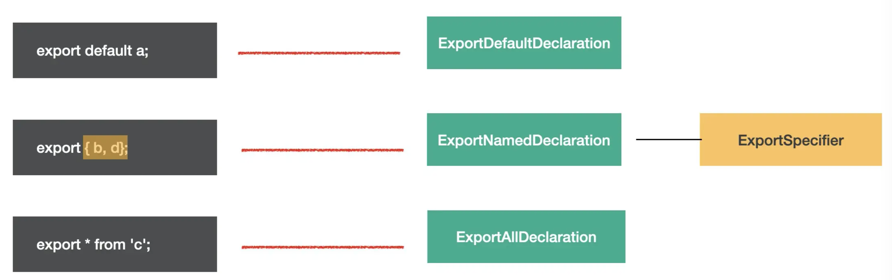 

### Program & Directive

program 是代表整个程序的节点，它有 body 属性代表程序体，存放 statement 数组，就是具体执行的语句的集合。还有 directives 属性，存放 Directive 节点，比如 `"use strict"` 这种指令会使用 Directive 节点表示。

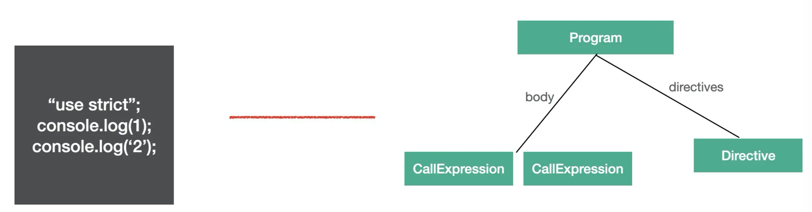

Program 是包裹具体执行语句的节点，而 Directive 则是代码中的指令部分。

### File & Comment

babel 的 AST 最外层节点是 File，它有 program、comments、tokens 等属性，分别存放 Program 程序体、注释、token 等，是最外层节点。

注释分为块注释和行内注释，对应 CommentBlock 和 CommentLine 节点。

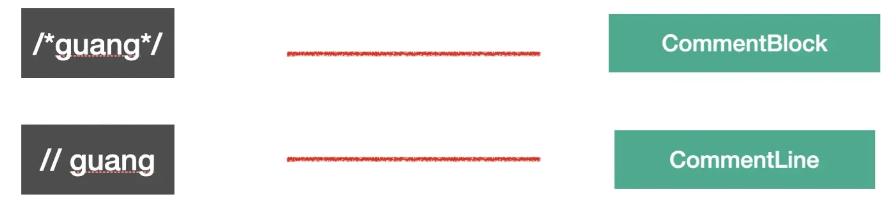

上面 6 种就是常见的一些 AST 节点类型，babel 就是通过这些节点来抽象源码中不同的部分。

## AST 可视化查看工具

[astexplorer](https://astexplorer.net/)

可切换 parser 为 @babel/parser

如果想查看全部的 AST 可以在[babel parser](https://github.com/babel/babel/blob/main/packages/babel-parser/ast/spec.md) 仓库里的 AST 文档里查，
或者直接去看 @babel/types 的 [typescript 类型定义](https://github.com/babel/babel/blob/main/packages/babel-types/src/ast-types/generated/index.ts)。

## AST 的公共属性

每种 AST 都有自己的属性，但是它们也有一些公共的属性：

* `type`: AST 节点的类型
* `start、end、loc`: start 和 end 代表该节点在源码中的开始和结束下标。而 loc 属性是一个对象，有 line 和 column 属性分别记录开始和结束的行列号。
* `leadingComments、innerComments、trailingComments`: 表示开始的注释、中间的注释、结尾的注释，每个 AST 节点中都可能存在注释，而且可能在开始、中间、结束这三种位置，想拿到某个 AST 的注释就通过这三个属性。
* `extra`: 记录一些额外的信息，用于处理一些特殊情况。比如 StringLiteral 的 value 只是值的修改，而修改 extra.raw 则可以连同单双引号一起修改。

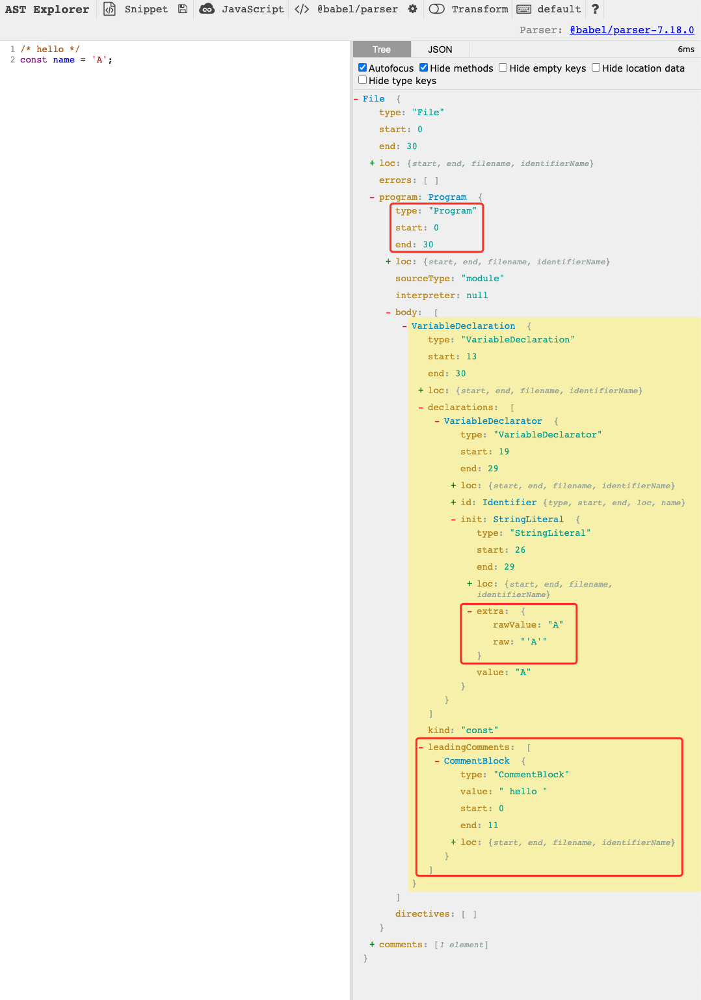

## 总结

本节介绍了，标识符（Identifer）、字面量（Literal）、语句（Statement）、声明语句（Declaration）、表达式（Expression），以及 Class、Modules、File、Program、Directive、Comment 这些 AST 节点。

AST 节点可能同时有多种类型，确定一种 AST 节点是什么类型主要看它的特点，比如 Statement 的特点是可以单独执行，Expression 的特点是有返回值，所以一些可以单独执行的 Expression 会包一层 ExpressionStatement。