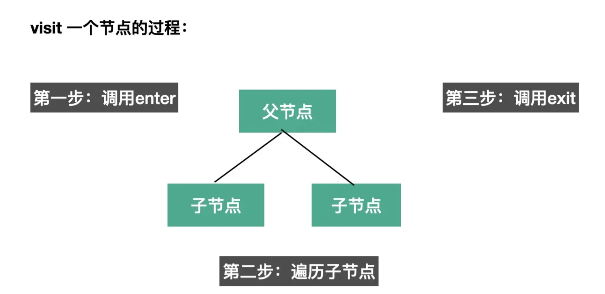
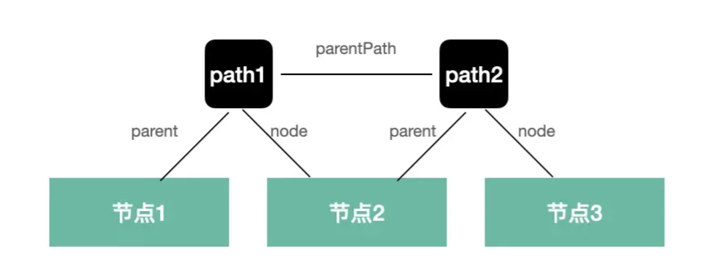
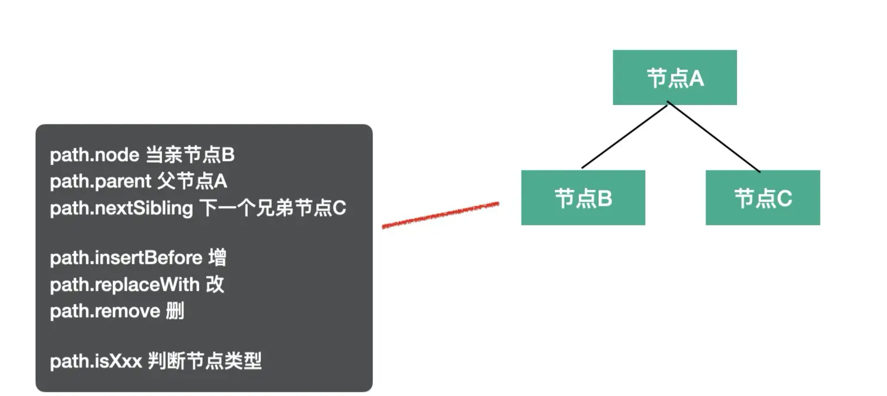
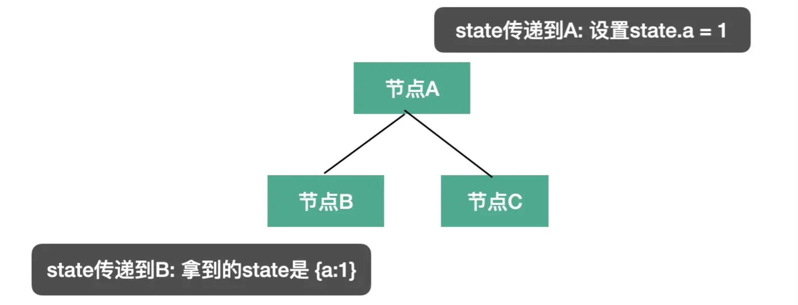

# babel API

## babel 的 api 有哪些

`babel` 的编译流程分为三步：`parse`、`transform`、`generate`，每一步都暴露了一些 api 出来。

* **parse** 阶段有 `@babel/parser`，功能是把源码转成 AST
* **transform** 阶段有 `@babel/traverse`，可以遍历 AST，并调用 visitor 函数修改 AST，修改 AST 自然涉及到 AST 的判断、创建、修改等，这时候就需要 `@babel/types` 了，当需要批量创建 AST 的时候可以使用 `@babel/template` 来简化 AST 创建逻辑。
* **generate** 阶段会把 AST 打印为目标代码字符串，同时生成 sourcemap，需要 `@babel/generator` 包
* 中途遇到错误想打印代码位置的时候，使用 `@babel/code-frame` 包
* babel 的整体功能通过 `@babel/core` 提供，基于上面的包完成 babel 整体的编译流程，并应用 plugin 和 preset。

以上相关包均可在 [babel 文档](https://babeljs.io/docs/en/babel-parser#options) 内查看.

## @babel/parser

babel parser 叫 babylon，是基于 acorn 实现的，扩展了很多语法，可以支持 es next（现在支持到 es2020）、jsx、flow、typescript 等语法的解析。

babel parser 默认只能 parse js 代码，jsx、flow、typescript 这些非标准的语法的解析需要指定语法插件。

它提供了有两个 api：parse 和 parseExpression。两者都是把源码转成 AST，不过 parse 返回的 AST 根节点是 File（整个 AST），parseExpression 返回的 AST 根节点是 Expression（表达式的 AST），粒度不同。

```typescript
function parse(input: string, options?: ParserOptions): File
function parseExpression(input: string, options?: ParserOptions): Expression
```

详细的 options 可以查看[文档](https://babeljs.io/docs/en/babel-parser#options)。其实主要分为两类，一是 parse 的内容是什么，二是以什么方式去 parse

### parse 的内容是什么

* `plugins`： 指定jsx、typescript、flow 等插件来解析对应的语法

* `allowXxx`： 指定一些语法是否允许，比如函数外的 await、没声明的 export等

* `sourceType`： 指定是否支持解析模块语法，有 module、script、unambiguous 3个取值：
  1) module：解析 es module 语法
  2) script：不解析 es module 语法
  3) unambiguous：根据内容是否有 import 和 export 来自动设置 module 还是 script
一般我们会指定 sourceType 为 unambiguous。

```js
const  parser = require('@babel/parser');

const ast = parser.parse("代码", {
    sourceType: 'unambiguous',
    plugins: ['jsx']
});
```

### 以什么方式 parse

* strictMode 是否是严格模式

* startLine 从源码哪一行开始 parse

* errorRecovery 出错时是否记录错误并继续往下 parse

* tokens parse 的时候是否保留 token 信息

* ranges 是否在 ast 节点中添加 ranges 属性

## @babel/traverse

parse 出的 AST 由 @babel/traverse 来遍历和修改，babel traverse 包提供了 traverse 方法：

```js
function traverse(parent, opts)
```

常用的就前面两个参数，parent 指定要遍历的 AST 节点，opts 指定 visitor 函数。babel 会在遍历 parent 对应的 AST 时调用相应的 visitor 函数。


### 遍历过程

visitor 是指定对什么 AST 做什么处理的函数，babel 会在遍历到对应的 AST 时回调它们。

而且可以指定刚开始遍历（enter）和遍历结束后（exit）两个阶段的回调函数，

比如：

```js
traverse(ast, {
  FunctionDeclaration: {
      enter(path, state) {}, // 进入节点时调用
      exit(path, state) {} // 离开节点时调用
  }
})
```

如果只指定了一个函数，那就是 enter 阶段会调用的：

```js
traverse(ast, {
  FunctionDeclaration(path, state) {} // 进入节点时调用
})
```

enter 时调用是在遍历当前节点的子节点前调用，exit 时调用是遍历完当前节点的子节点后调用。

 

而且同一个 visitor 函数可以用于多个 AST 节点的处理，方式是指定一系列 AST，用 | 连接：

```js
// 进入 FunctionDeclaration 和 VariableDeclaration 节点时调用
traverse(ast, {
  'FunctionDeclaration|VariableDeclaration'(path, state) {}
})
```

此外，AST 还有别名的，比如各种 XxxStatement 有个 Statement 的别名，各种 XxxDeclaration 有个 Declaration 的别名，那自然可以通过别名来指定对这些 AST 的处理：

```js
// 通过别名指定离开各种 Declaration 节点时调用
traverse(ast, {
  Declaration: {
      exit(path, state) {}
  }
})
```

具体的别名有哪些在[babel-types](https://github.com/babel/babel/blob/main/packages/babel-types/src/ast-types/generated/index.ts#L2059) 的类型定义可以查。

### visitor 中的 path

AST 是棵树，遍历过程中肯定是有个路径的，path 就记录了这个路径：

 

如图，节点 1、节点 2、节点 3 是三层 AST，通过两个 path 关联了起来，

path1 就关联了节点 1 和 节点 2，记录了节点 1 是父节点，节点 2 是子节点。

path2 关联了节点 2 和节点 3，记录了节点 2 是父节点，节点 3 是子节点。

而且 path1 和 path2 还有父子关系。

通过这样的 path 对象，那不就把遍历的路径串联起来了么。

而且，最重要的是 path 有很多属性和方法，比如记录父子、兄弟等关系的：

* path.node 指向当前 AST 节点
* path.parent 指向父级 AST 节点
* path.getSibling、path.getNextSibling、path.getPrevSibling 获取兄弟节点
* path.find 从当前节点向上查找节点
* path.get、path.set 获取 / 设置属性的 path

还有作用域相关的：

* path.scope 获取当前节点的作用域信息

判断 AST 类型的：

* path.isXxx 判断当前节点是不是 xx 类型
* path.assertXxx 判断当前节点是不是 xx 类型，不是则抛出异常

增删改 AST 的：

* path.insertBefore、path.insertAfter 插入节点
* path.replaceWith、path.replaceWithMultiple、replaceWithSourceString 替换节点
* path.remove 删除节点

跳过遍历的：

* path.skip 跳过当前节点的子节点的遍历
* path.stop 结束后续遍历

path 的 api 是学习 babel 插件最核心的。

 

上面罗列了一些常用的 api，可以通过这些 api 完成对 AST 的操作。当然，path 的 api 不是只有这些.

### visitor 中的 state

第二个参数 state 则是遍历过程中在不同节点之间传递数据的机制，插件会通过 state 传递 options 和 file 信息，我们也可以通过 state 存储一些遍历过程中的共享数据。

 

## @babel/types

遍历 AST 的过程中需要创建一些 AST 和判断 AST 的类型，这时候就需要 `@babel/types` 包。

举例来说，如果要创建IfStatement就可以调用

```js
t.ifStatement(test, consequent, alternate);
```

而判断节点是否是 IfStatement 就可以调用 isIfStatement 或者 assertIfStatement

```js
t.isIfStatement(node, opts);
t.assertIfStatement(node, opts);
```

opts 可以指定一些属性是什么值，增加更多限制条件，做更精确的判断。

```js
t.isIdentifier(node, { name: "paths" })
```

isXxx 和 assertXxx 看起来很像，但是功能不大一样：isXxx 会返回 boolean，而 assertXxx 则会在类型不一致时抛异常。

所有的 AST 的 build、assert 的 api 可以在 [babel types 文档](https://babeljs.io/docs/en/babel-types#api)中查。

## @babel/template

通过 @babel/types 创建 AST 还是比较麻烦的，要一个个的创建然后组装，如果 AST 节点比较多的话需要写很多代码，这时候就可以使用 `@babel/template` 包来批量创建。

这个包有这些 api：

```js
const ast = template(code, [opts])(args);
const ast = template.ast(code, [opts]);
const ast = template.program(code, [opts]);
```

这些都是传入一段字符串，返回创建好的 AST，区别只是返回的 AST 粒度不大一样：

* template.ast 返回的是整个 AST。

* template.program 返回的是 Program 根节点。

* template.expression 返回创建的 expression 的 AST。

* template.statements 返回创建的 statems 数组的 AST。

用 template.ast 创建的 Expression 会被包裹一层 ExpressionStatement 节点，而 template.expression 方法创建的 AST 就不会。

所以，当你明确知道了创建的 AST 的类型的话，用更细粒度的 api 会方便一些。

模版也支持占位符，可以在模版里设置一些占位符，调用时再传入这些占位符参数对应的 AST 节点。

```js
const fn = template(`console.log(NAME)`);

const ast = fn({
  NAME: t.stringLiteral("guang"),
});

// 或者

const fn = template(`console.log(%%NAME%%)`);

const ast = fn({
  NAME: t.stringLiteral("guang"),
});
```

这样就是通过模版来批量创建 AST，但是其中的占位符是用传入的 AST。

加不加 %% 都行，当占位符和其他变量名冲突时可以加上。

## @babel/generator

AST 转换完之后就要打印成目标代码字符串，通过 `@babel/generator` 包的 generate api

```js
function (ast: Object, opts: Object, code: string): { code, map } 
```

第一个参数是要打印的 AST。

第二个参数是 options，指定打印的一些细节，比如通过 comments 指定是否包含注释，通过 minified 指定是否包含空白字符。

第三个参数当多个文件合并打印的时候需要用到，这部分直接看[文档](https://babeljs.io/docs/en/babel-generator)即可，基本用不到。

options 中常用的是 sourceMaps，开启了这个选项才会生成 sourcemap。

```js
import generate from "@babel/generator";

const { code, map } = generate(ast, { sourceMaps: true })
```

## @babel/code-frame

babel 的报错一半都会直接打印错误位置的代码，而且还能高亮，

我们打印错误信息的时候也可以用，就是 `@babel/code-frame` 这个包。

```js
const result = codeFrameColumns(rawLines, location, {
  /* options */
});
```

options 可以设置 highlighted （是否高亮）、message（展示啥错误信息）。

比如:

```js
const { codeFrameColumns } = require("@babel/code-frame");

try {
 throw new Error("xxx 错误");
} catch (err) {
  console.error(codeFrameColumns(`const name = guang`, {
      start: { line: 1, column: 14 }
  }, {
    highlightCode: true,
    message: err.message
  }));
}
```

这种控制台打印代码格式的功能就叫做 code frame。

## @babel/core

前面讲了 `@babel/parser`、`@babel/traverse`、`@babel/generaotr`、`@babel/types`、`@babel/template` 等包，babel 的功能就是通过这些包来实现的。

babel 基于这些包来实现编译、插件、预设等功能的包就是 @babel/core。

这个包的功能就是完成整个编译流程，从源码到目标代码，生成 sourcemap。实现 plugin 和 preset 的调用。

api 也有好几个：

```js
transformSync(code, options); // => { code, map, ast }

transformFileSync(filename, options); // => { code, map, ast }

transformFromAstSync(
  parsedAst,
  sourceCode,
  options
); // => { code, map, ast }
```

比如这三个 transformXxx 的 api 分别是从源代码、源代码文件、源代码 AST 开始处理，最终生成目标代码和 sourcemap。

options 主要配置 plugins 和 presets，指定具体要做什么转换。

这些 api 也同样提供了异步的版本，异步地进行编译，返回一个 promise

```js
transformAsync("code();", options).then(result => {})
transformFileAsync("filename.js", options).then(result => {})
transformFromAstAsync(parsedAst, sourceCode, options).then(result => {})
```

注意：不带 sync、async 的 api 已经被标记过时了，也就是 transformXxx 这些，后续会删掉，不建议用，直接用 transformXxxSync 和 transformXxxAsync。也就是明确是同步还是异步。

@babel/core 支持 plugin 和 preset，一般我们配置的都是对象的格式，其实也有一个 api 来创建，也就是 createConfigItem：

```js
createConfigItem(value, options) // configItem
```

不过用和不用的没啥区别，常用的还是直接写配置对象。

## 总结

这一节我们了解了编译过程中各阶段的 api：

* @babel/parser 对源码进行 parse，可以通过 plugins、sourceType 等来指定 parse 语法

* @babel/traverse 通过 visitor 函数对遍历到的 ast 进行处理，分为 enter 和 exit 两个阶段，具体操作 AST 使用 path 的 api，还可以通过 state 来在遍历过程中传递一些数据

* @babel/types 用于创建、判断 AST 节点，提供了 xxx、isXxx、assertXxx 的 api

* @babel/template 用于批量创建节点

* @babel/code-frame 可以创建友好的报错信息

* @babel/generator 打印 AST 成目标代码字符串，支持 comments、minified、sourceMaps 等选项。

* @babel/core 基于上面的包来完成 babel 的编译流程，可以从源码字符串、源码文件、AST 开始。