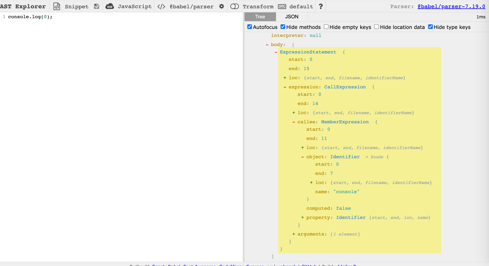
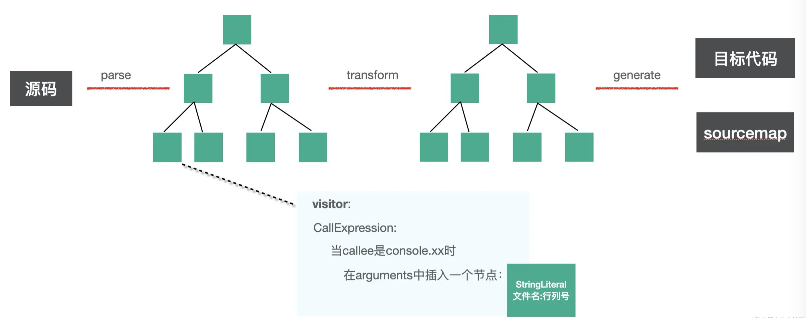

# 示例-插入函数调用参数

## 背景

我们经常会打印一些日志来辅助调试，但是有的时候会不知道日志是在哪个地方打印的。

## 目标

希望通过 babel 能够自动在 console.log 等 api 中插入文件名和行列号的参数，方便定位到代码。

```js
// 现状
console.log(0);

// 目标
console.log('文件名（行号，列号）：', 0);
```

## 实现思路

使用 [astexplorer.net](https://astexplorer.net) 分析

 

函数调用表达式的 AST 是 CallExpression。

我们要做的是在遍历 AST 的时候对 console.log、console.info 等 api 自动插入一些参数，也就是要通过 `visitor` 指定对 CallExpression 的 AST 做一些修改。

CallExrpession 节点有两个属性，callee 和 arguments，分别对应调用的函数名和参数， 所以我们要判断当 callee 是 console.xx 时，在 arguments 的数组中中插入一个 AST 节点。

 

## 代码实现

需要安装 `@babel/parser`、`@babel/traverse`、`@babel/generator`, 编译流程是 `parse`、`transform`、`generate`，整体框架如下：

```js
const parser = require('@babel/parser')
const traverse = require('@babel/traverse').default
const generate = require('@babel/generator').default

const sourceCode = `console.log(0);`

const ast = parser.parse(sourceCode, {
  sourceType: 'unambiguous'
})

traverse(ast, {
  CallExpression(path, state) {

  }
})

const { code, map } = generate(ast)

console.log(code)
```

:::tip
`ES module` 导出的包，通过 `commonjs` 方式引入时需要取 `default` 属性
:::

`parser` 需要知道代码是不是符合 ES module 规范，需要给 options.sourceType 设置值为 `module`、`script`、`unambiguous`，`unambiguous` 会根据内容是否包含 import、export 来自动设置


接下来将 `sourceCode` 设计复杂一些，如下：

```js
const sourceCode = `
    console.log(1);

    function func() {
        console.info(2);
    }

    export default class Clazz {
        say() {
            console.debug(3);
        }
        render() {
            return <div>{console.error(4)}</div>
        }
    }
`;
```

这里用到了 jsx 的语法，所以 parser 要开启 jsx 的 plugin。

```js
const ast = parser.parse(sourceCode, {
    sourceType: 'unambiguous',
    plugins: ['jsx']
});
```

我们要修改 CallExpression 的 AST，如果是 console.xxx 的 api，那就在 arguments 中插入行列号的参数：

```js
const parser = require('@babel/parser');
const traverse = require('@babel/traverse').default;
const types = require('@babel/types');

const ast = parser.parse(sourceCode, {
    sourceType: 'unambiguous',
    plugins: ['jsx']
});

traverse(ast, {
    CallExpression (path, state) {
        if ( types.isMemberExpression(path.node.callee) 
            && path.node.callee.object.name === 'console' 
            && ['log', 'info', 'error', 'debug'].includes(path.node.callee.property.name) 
           ) {
            const { line, column } = path.node.loc.start;
            path.node.arguments.unshift(types.stringLiteral(`filename: (${line}, ${column})`))
        }
    }
});
```

`types.isMemberExpression` 判断当前 callee 的类型是否为 `MemberExpression`

`path.node` 获取当前 node 对象，其中包含 `loc`、`callee`、`arguments` 等

效果

```js
// node .js

console.log("filename: (2, 0)", 1);
function func() {
  console.info("filename: (5, 4)", 2);
}
export default class Clazz {
  say() {
    console.debug("filename: (10, 8)", 3);
  }
  render() {
    return <div>{console.error("filename: (13, 21)", 4)}</div>;
  }
}
```

[源码](https://github.com/dengwb1991/lifelong-learning/blob/master/babel/001_exercize-parameters-insert/src/demo1.js)


### 优化

对判断条件语法进行简化，把 callee 的 AST 打印成字符串后再判断：

```js
const targetCalleeName = ['log', 'info', 'error', 'debug'].map(item => `console.${item}`);

traverse(ast, {
    CallExpression(path, state) {
        const calleeName = generate(path.node.callee).code;
        // const calleeName = path.get('callee').toString()
        if (targetCalleeName.includes(calleeName)) {
            const { line, column } = path.node.loc.start;
            path.node.arguments.unshift(types.stringLiteral(`filename: (${line}, ${column})`))
        }
    }
});
```

不调用 `generate` 的话，也可以使用 `path.get('callee').toString()`

## 需求变更

### 目标

期望在节点之前打印位置；

```js
console.log(1)

// 期望转换为

console.log('文件名（行号，列号）：')
console.log(1)
```

### 实现思路

1. 这个需求的改动只是从插入一个参数变成了在当前 console.xx 的 AST 之前插入一个 console.log 的 AST，整体流程还是一样。

2. JSX 中的 console 代码不能简单的在前面插入一个节点，而要把整体替换成一个数组表达式，因为 JSX 中只支持写单个表达式。

```js
<div>{console.log(111)}</div>

<div>{[console.log('filename.js(11,22)'), console.log(111)]}</div>
```

因为 `{}` 里只能是表达式，这个 AST 叫做 JSXExpressionContainer，表达式容器。

### 代码实现

```js
if (path.findParent(path => path.isJSXElement())) {
    path.replaceWith(types.arrayExpression([newNode, path.node]))
    path.skip();// 跳过子节点处理
} else {
    path.insertBefore(newNode);
}
```

`path.insertBefore` 插入 AST

`path.replaceWith` 替换 AST

`path.findParent` 遍历 AST

`path.isJSXElement` 是否为 JSXElement

`path.skip` 跳过新节点的遍历

### 完整代码

```js
const parser = require('@babel/parser');
const traverse = require('@babel/traverse').default;
const generate = require('@babel/generator').default;
const types = require('@babel/types');
const template = require('@babel/template').default;

const sourceCode = `
console.log(1);

function func() {
    console.info(2);
}

export default class Clazz {
    say() {
        console.debug(3);
    }
    render() {
        return <div>{console.error(4)}</div>
    }
}
`

const ast = parser.parse(sourceCode, {
    sourceType: 'unambiguous',
    plugins: ['jsx']
});

const targetCalleeName = ['log', 'info', 'error', 'debug'].map(item => `console.${item}`);

traverse(ast, {
    CallExpression(path, state) {
        if (path.node.isNew) {
            return;
        }
        const calleeName = generate(path.node.callee).code;
         if (targetCalleeName.includes(calleeName)) {
            const { line, column } = path.node.loc.start;

            const newNode = template.expression(`console.log("filename: (${line}, ${column})")`)();
            newNode.isNew = true;

            if (path.findParent(path => path.isJSXElement())) {
                path.replaceWith(types.arrayExpression([newNode, path.node]))
                path.skip();
            } else {
                path.insertBefore(newNode);
            }
        }
    }
});

const { code, map } = generate(ast)

console.log(code)

// console.log("filename: (2, 0)")
// console.log(1);
// function func() {
//   console.log("filename: (5, 4)")
//   console.info(2);
// }
// export default class Clazz {
//   say() {
//     console.log("filename: (10, 8)")
//     console.debug(3);
//   }
//   render() {
//     return <div>{[console.log("filename: (13, 21)"), console.error(4)]}</div>;
//   }
// }
```

## 改造成 babel 插件

### 实现思路

首先 `babel` 支持 `transform` 插件，如下：

```js
module.exports = function (api, options) {
    return {
        visitor: {
            Identifier (path, state) {}
        }
    }
}
```

`babel` 插件的形式就是函数返回一个对象，对象有 `visitor` 属性;

函数的第一个参数( `api` ) 可以拿到 `types`、`template` 等常用的包的 API，这样我们就不需要单独引入这些依赖包了；

作为插件使用的时候，并不需要自己调用 `parse`、`traverse`、`generate`，这些都是通用流程，babel 会帮助做，我们只需要提供一个 `visitor` 函数，在这个函数内完成转换功能就可以了；

函数的第二个参数( `options` ) 可以拿到插件的配置信息，比如 `filename`，在上面代码 `state` 中，可以拿到 `options`；

### 代码实现

```js
const targetCalleeName = ['log', 'info', 'error', 'debug'].map(item => `console.${item}`);

const parametersInsertPlugin = ({ types, template }, options, dirname) => {
    return {
        visitor: {
            CallExpression(path, state) {
                if (path.node.isNew) {
                    return;
                }
                const calleeName = path.get('callee').toString();

                if (targetCalleeName.includes(calleeName)) {
                    const { line, column } = path.node.loc.start;
                    const newNode = template.expression(`console.log("${state.filename || 'unkown filename'}: (${line}, ${column})")`)();
                    newNode.isNew = true;

                    if (path.findParent(path => path.isJSXElement())) {
                        path.replaceWith(types.arrayExpression([newNode, path.node]))
                        path.skip();
                    } else {
                        path.insertBefore(newNode);
                    }
                }
            }
        }
    }
}
module.exports = parametersInsertPlugin;
```

然后通过 `@babel/core` 的 `transformSync` 方法来编译代码，并引入上面的插件：

```js
const { transformFileSync } = require('@babel/core');
const insertParametersPlugin = require('./plugin/parameters-insert-plugin');
const path = require('path');

const { code } = transformFileSync(path.join(__dirname, './sourceCode.js'), {
    plugins: [insertParametersPlugin],
    parserOpts: {
        sourceType: 'unambiguous',
        plugins: ['jsx']       
    }
});

console.log(code);
```

这样我们成功就把前面调用 parse、traverse、generate 的代码改造成了 babel 插件的形式，只需要提供一个转换函数，traverse 的过程中会自动调用。

[源码](https://github.com/dengwb1991/lifelong-learning/blob/master/babel/001_exercize-parameters-insert/src/demo3/index.js)

## 总结

首先通过 `@babel/parser`、`@babel/traverse`、`@babel/generator` 来组织编译流程，通过 `@babel/types` 创建AST，通过 path 的各种 api 对 AST 进行操作。

后来需求改为在前面插入 console.xxx 的方式，我们引入了 `@babel/template` 包，通过 path.replaceWith 和 path.insertBefore 来对 AST 做插入和替换，需要通过 path.findParent 来判断 AST 的父元素是否包含 JSXElement 类型的 AST。子节点的 AST 要用 path.skip 跳过遍历，而且要对新的 AST 做标记，跳过对新生成的节点的处理。

之后我们把它改造成了 babel 插件，也就是一个函数返回一个对象的格式，函数的第一个参数可以拿到各种 babel 常用包的 api，比如 types、template。 插件不需要调用 parse、traverse、generate 等 api，只需要提供 visitor 函数。最后我们通过 @babel/core 的 api 使用了下这个插件。