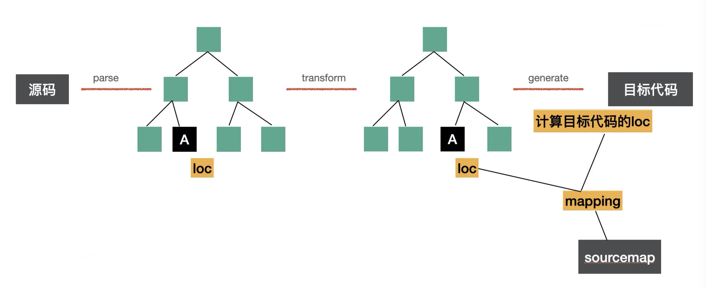

# Generator 和 sourceMap

## generate

generate 是把 AST 打印成字符串，是一个从根节点递归打印的过程，对不同的 AST 节点做不同的处理，在这个过程中把抽象语法树中省略掉的一些分隔符重新加回来。


比如 while 语句 WhileStatement 就是先打印 while，然后打印一个空格和 '('，然后打印 node.test 属性的节点，然后打印 ')'，之后打印 block 部分

[Generators Statements](https://github.com/babel/babel/blob/main/packages/babel-generator/src/generators/statements.ts)

```js
export function WhileStatement(this: Printer, node: t.WhileStatement) {
  this.word("while");
  this.space();
  this.token("(");
  this.print(node.test, node);
  this.token(")");
  this.printBlock(node);
}

```

比如条件表达式 ConditionalExpression 就是分别打印 node.test、node.consequent、node.alternate 属性，中间插入 ? : 和空格。

[Generators Statements](https://github.com/babel/babel/blob/main/packages/babel-generator/src/generators/expressions.ts)

```js
export function ConditionalExpression(
  this: Printer,
  node: t.ConditionalExpression,
) {
  this.print(node.test, node);
  this.space();
  this.token("?");
  this.space();
  this.print(node.consequent, node);
  this.space();
  this.token(":");
  this.space();
  this.print(node.alternate, node);
}
```

通过这样的方式递归打印整个 AST，就可以生成目标代码。

## sourcemap

### sourcemap作用

babel 对源码进行了修改，生成的目标代码可能改动很大，如果直接调试目标代码，那么可能很难对应到源码里。所以需要一种自动关联源码的方式，就是 sourcemap。

我们平时用 sourcemap 主要用两个目的：

#### 调试代码时定位到源码

chrome、firefox 等浏览器支持在文件末尾加上[一行注释](https://firefox-source-docs.mozilla.org/devtools-user/debugger/how_to/use_a_source_map/index.html)

```js
//# sourceMappingURL=http://example.com/path/to/your/sourcemap.map
```

可以通过 url 的方式或者转成 base64 内联的方式来关联 sourcemap。调试工具（浏览器、vscode 等会自动解析 sourcemap，关联到源码。这样打断点、错误堆栈等都会对应到相应源码。

#### 线上报错定位到源码

开发时会使用 sourcemap 来调试，但是生产可不会，要是把 sourcemap 传到生产算是大事故了。但是线上报错的时候确实也需要定位到源码，这种情况一般都是单独上传 sourcemap 到错误收集平台。

比如 sentry 就提供了一个 [@sentry/webpack-plugin](https://www.npmjs.com/package/@sentry/webpack-plugin) 支持在打包完成后把 sourcemap 自动上传到 sentry 后台，然后把本地 sourcemap 删掉。还提供了 [@sentry/cli](https://www.npmjs.com/package/@sentry/cli) 让用户可以手动上传。

平时我们至少在这两个场景（开发时调试源码，生产时定位错误）下会用到 sourcemap。

### sourcemap格式

```js
{
　　version : 3,
   file: "out.js",
   sourceRoot : "",
   sources: ["foo.js", "bar.js"],
   names: ["src", "maps", "are", "fun"],
   mappings: "AAgBC,SAAQ,CAAEA"
}
```

比如上面就是一个 sourcemap 文件，对应字段的含义如下：

* version：source map的版本，目前为3。

* file：转换后的文件名。

* sourceRoot：转换前的文件所在的目录。如果与转换前的文件在同一目录，该项为空。

* sources：转换前的文件。该项是一个数组，因为可能是多个源文件合并成一个目标文件。

* names：转换前的所有变量名和属性名，把所有变量名提取出来，下面的 mapping 直接使用下标引用，可以减少体积。

* mappings：转换前代码和转换后代码的映射关系的集合，用分号代表一行，每行的 mapping 用逗号分隔。

每一个分号 `;` 表示一行，多个空行就是多个 `;`，mapping 通过 `,` 分割。

mapping有五位：

* 第一位是目标代码中的列数
* 第二位是源码所在的文件名
* 第三位是源码对应的行数
* 第四位是源码对应的列数
* 第五位是源码对应的 names，不一定有

每一位是通过 VLQ 编码的，一个字符就能表示行列数，[原理探究](https://juejin.cn/post/6844903689610592269)

sourcemap 通过 `names` 和 `;` 的设计省略掉了一些变量名和行数所占的空间，又通过 VLQ 编码使得一个字符就可以表示行列数等信息。通过不大的空间占用完成了源码到目标代码的映射。

那么 sourcemap 的源码和目标代码的行列数是怎么来的呢？

其实我们在 parse 的时候就在 AST 节点中保存了 loc 属性，这就是源码中的行列号，在后面 transform 的过程中，并不会去修改它，所以转换完以后节点中仍然保留有源码中的行列号信息，在 generate 打印成目标代码的时候会计算出新的行列号，这样两者关联就可以生成 sourcemap。



具体生成 sourcemap 的过程是用 mozilla 维护的 [source-map](https://www.npmjs.com/package/source-map) 这个包，其他工具做 sourcemap 的解析和生成也是基于这个包。