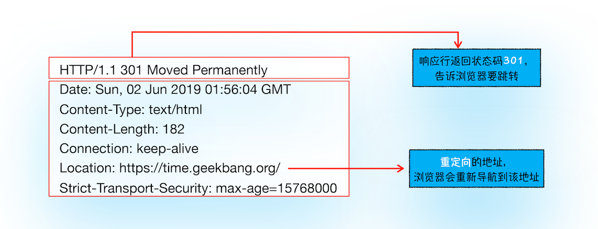

# 从输入URL到页面展示

从图中可以看出，整个过程需要各个进程之间的配合，所以在开始正式流程之前，我们还是先来快速回顾下浏览器进程、渲染进程和网络进程的主要职责。

* 浏览器进程主要负责用户交互、子进程管理和文件储存等功能。
* 网络进程是面向渲染进程和浏览器进程等提供网络下载功能。
* 渲染进程的主要职责是把从网络下载的 HTML、JavaScript、CSS、图片等资源解析为可以显示和交互的页面。因为渲染进程所有的内容都是通过网络获取的，会存在一些恶意代码利用浏览器漏洞对系统进行攻击，所以运行在渲染进程里面的代码是不被信任的。这也是为什么 Chrome 会让渲染进程运行在安全沙箱里，就是为了保证系统的安全。

回顾了浏览器的进程架构后，我们再结合上图来看下这个完整的流程，可以看出，整个流程包含了许多步骤，我把其中几个核心的节点用蓝色背景标记出来了。这个过程可以大致描述为如下。

* 首先，浏览器进程接收到用户输入的 URL 请求，浏览器进程便将该 URL 转发给网络进程，然后，在网络进程中发起真正的 URL 请求；
* 接着网络进程接收到了响应头数据，便解析响应头数据，并将数据转发给浏览器进程；
* 浏览器进程接收到网络进程的响应头数据之后，发送“提交导航 (CommitNavigation)”消息到渲染进程；
* 渲染进程接收到“提交导航”的消息之后，便开始准备接收 HTML 数据，接收数据的方式是直接和网络进程建立数据管道；
* 最后渲染进程会向浏览器进程“确认提交”，这是告诉浏览器进程：“已经准备好接受和解析页面数据了”。
* 浏览器进程接收到渲染进程“提交文档”的消息之后，便开始移除之前旧的文档，然后更新浏览器进程中的页面状态。

这其中，**用户发出 URL 请求到页面开始解析的这个过程，就叫做导航。**

## 逐步分析各个阶段

### 1. 用户输入

#### 判断地址栏内容

当用户在地址栏中输入一个查询关键字时，地址栏会判断输入的关键字是**搜索内容**，还是**请求的 URL**。

> 如果是搜索内容，地址栏会使用浏览器默认的搜索引擎，来合成新的带搜索关键字的 URL。
> 如果判断输入内容符合 URL 规则，那么地址栏会根据规则，把这段内容加上协议，合成为完整的 URL。

#### 执行 beforeunload 事件

当用户输入关键字并键入回车之后，这意味着当前页面即将要被替换成新的页面，不过在这个流程继续之前，浏览器还给了当前页面一次执行 `beforeunload` 事件的机会，beforeunload 事件允许页面在退出之前执行一些数据清理操作，还可以询问用户是否要离开当前页面，比如当前页面可能有未提交完成的表单等情况，因此用户可以通过 beforeunload 事件来取消导航，让浏览器不再执行任何后续工作。

#### 进入加载状态

当浏览器刚开始加载一个地址之后，标签页上的图标便进入了加载状态。但此时页面显示的依然是之前打开的页面内容，并没立即替换为新页面。因为需要等待提交文档阶段，页面内容才会被替换。

### 2. URL 请求过程

接下来，便进入了页面资源请求过程。这时，浏览器进程会通过进程间通信（IPC）把 URL 请求发送至网络进程，网络进程接收到 URL 请求后，会在这里发起真正的 URL 请求流程。

#### 查询缓存DNS解析获取服务器IP

首先，网络进程会查找本地缓存是否缓存了该资源。如果有缓存资源，那么直接返回资源给浏览器进程；如果在缓存中没有查找到资源，那么直接进入网络请求流程。这请求前的第一步是要进行 DNS 解析，以获取请求域名的服务器 IP 地址。如果请求协议是 HTTPS，那么还需要建立 TLS 连接。

#### 建立TCP连接

接下来就是利用 IP 地址和服务器建立 TCP 连接。连接建立之后，浏览器端会构建请求行、请求头等信息，并把和该域名相关的 Cookie 等数据附加到请求头中，然后向服务器发送构建的请求信息。

服务器接收到请求信息后，会根据请求信息生成响应数据（包括响应行、响应头和响应体等信息），并发给网络进程。等网络进程接收了响应行和响应头之后，就开始解析响应头的内容了。（为了方便讲述，下面我将服务器返回的响应头和响应行统称为响应头。）

#### 是否重定向

在接收到服务器返回的响应头后，网络进程开始解析响应头，如果发现返回的状态码是 301 或者 302，那么说明服务器需要浏览器重定向到其他 URL。这时网络进程会从响应头的 Location 字段里面读取重定向的地址，然后再发起新的 HTTP 或者 HTTPS 请求，一切又重头开始了。

可以通过 `curl -I https://notes.dengwb.com` 查看.

在导航过程中，如果服务器响应行的状态码包含了 301、302 一类的跳转信息，浏览器会跳转到新的地址继续导航；如果响应行是 200，那么表示浏览器可以继续处理该请求。

#### 响应数据类型处理

Content-Type 是 HTTP 头中一个非常重要的字段， 它告诉浏览器服务器返回的响应体数据是什么类型

从图中可以看到，响应头中的 Content-type 字段的值是 text/html，这就是告诉浏览器，服务器返回的数据是 HTML 格式。

若Content-Type 的值是 application/octet-stream，显示数据是字节流类型的，通常情况下，浏览器会按照下载类型来处理该请求，那么该请求会被提交给浏览器的下载管理器，同时该 URL 请求的导航流程就此结束。但如果是 HTML，那么浏览器则会继续进行导航流程。由于 Chrome 的页面渲染是运行在渲染进程中的，所以接下来就需要准备渲染进程了。

### 3. 准备渲染进程

默认情况下，Chrome 会为每个页面分配一个渲染进程，也就是说，每打开一个新页面就会配套创建一个新的渲染进程。**但是，也有一些例外，在某些情况下，浏览器会让多个页面直接运行在同一个渲染进程中。**

那什么情况下多个页面会同时运行在一个渲染进程中呢？

如果从一个页面打开了另一个新页面，而新页面和当前页面属于同一站点的话，那么新页面会复用父页面的渲染进程。

### 4. 提交文档

所谓提交文档，就是指浏览器进程将网络进程接收到的 HTML 数据提交给渲染进程，具体流程是这样的：

* 首先当浏览器进程接收到网络进程的响应头数据之后，便向渲染进程发起“提交文档”的消息；
* 渲染进程接收到“提交文档”的消息后，会和网络进程建立传输数据的“管道”；
* 等文档数据传输完成之后，渲染进程会返回“确认提交”的消息给浏览器进程；
* 浏览器进程在收到“确认提交”的消息后，会更新浏览器界面状态，包括了安全状态、地址栏的 URL、前进后退的历史状态，并更新 Web 页面。

这也就解释了为什么在浏览器的地址栏里面输入了一个地址后，之前的页面没有立马消失，而是要加载一会儿才会更新页面。

### 5. 渲染阶段

一旦文档被提交，渲染进程便开始页面解析和子资源加载了.

## 简洁版回答

1. 查看缓存（浏览器缓存，系统缓存，路由器缓存），如果有直接访问
2. 如果没有，DNS服务器进行域名解析，解析成ip地址
3. 通过ip地址找到服务器，进行TCP链接，完成三次握手
4. 浏览器像服务器发送http请求
5. 服务器响应，将响应报文通过TCP发送回浏览器
6. 对响应进行解码，根据资源类型决定如何处理
7. 如果是HTML文档，则构建DOM树，下载CSS，JS资源，构建渲染树，布局，绘制