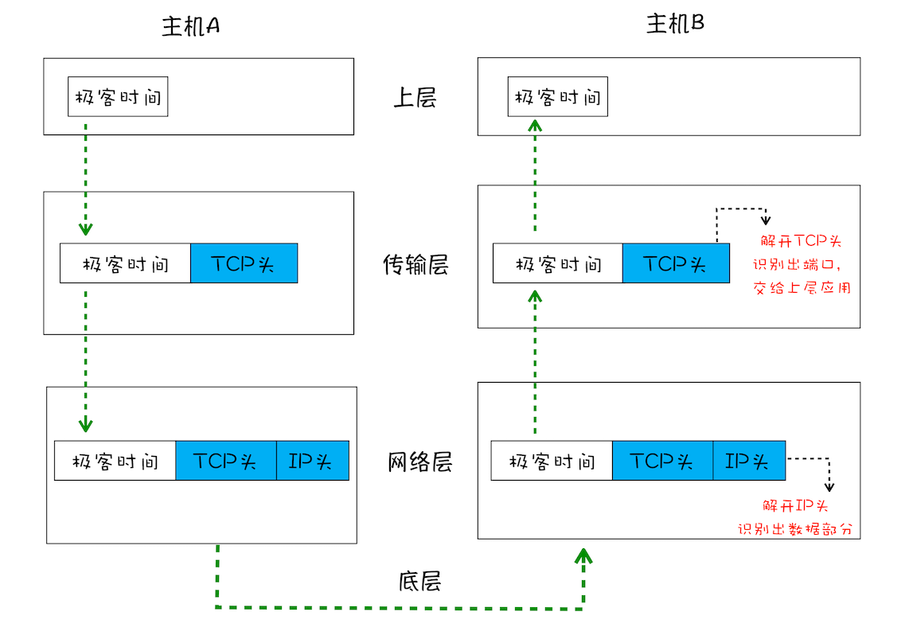

# IP & UDP & TCP

在衡量 Web 页面性能的时候有一个重要的指标叫“FP（First Paint）”，是**指从页面加载到首次开始绘制的时长**。这个指标直接影响了用户的跳出率，更快的页面响应意味着更多的 PV、更高的参与度，以及更高的转化率。那什么影响 FP 指标呢？其中一个重要的因素是网络加载速度。

在网络中，一个文件通常会被拆分为很多数据包来进行传输，而数据包在传输过程中又有很大概率丢失或者出错。**那么如何保证页面文件能被完整地送达浏览器呢？**

## 数据包传输

互联网中的数据是通过数据包来传输的。如果发送的数据很大，那么该数据就会被拆分为很多小数据包来传输。比如你现在听的音频数据，是拆分成一个个小的数据包来传输的，并不是一个大的文件一次传输过来的。

### **IP：把数据包送达目的主机**

数据包要在互联网上进行传输，就要符合**网际协议**（Internet Protocol，简称 IP）标准。
互联网上不同的在线设备都有唯一的地址，地址只是一个数字，这和大部分家庭收件地址类似，你只需要知道一个家庭的具体地址，就可以往这个地址发送包裹，这样物流系统就能把物品送到目的地。

计算机的地址就称为 IP 地址，访问任何网站实际上只是你的计算机向另外一台计算机请求信息。

如果要想把一个数据包从主机 A 发送给主机 B，那么在传输之前，数据包上会被附加上主机 B 的 IP 地址信息，这样在传输过程中才能正确寻址。额外地，数据包上还会附加上主机 A 本身的 IP 地址，有了这些信息主机 B 才可以回复信息给主机 A。这些附加的信息会被装进一个叫 IP 头的数据结构里。IP 头是 IP 数据包开头的信息，包含 IP 版本、源 IP 地址、目标 IP 地址、生存时间等信息。如果你要详细了解 IP 头信息，可以参考 [该链接](https://zh.wikipedia.org/wiki/%E4%BC%A0%E8%BE%93%E6%8E%A7%E5%88%B6%E5%8D%8F%E8%AE%AE)。

网络简单分为三层结构，如下图：

* 上层将含有“极客时间”的数据包交给网络层；
* 网络层再将 IP 头附加到数据包上，组成新的 **IP 数据包**，并交给底层；
* 底层通过物理网络将数据包传输给主机 B；
* 数据包被传输到主机 B 的网络层，在这里主机 B 拆开数据包的 IP 头信息，并将拆开来的数据部分交给上层；
* 最终，含有“极客时间”信息的数据包就到达了主机 B 的上层了。

### **UDP：把数据包送达应用程序**

IP 是非常底层的协议，只负责把数据包传送到对方电脑，但是对方电脑并不知道把**数据包交给哪个程序**。因此，需要基于 IP 之上开发能和应用打交道的协议，最常见的是“用户数据包协议（User Datagram Protocol）”，简称 **UDP**。

UDP 中一个最重要的信息是**端口号**，端口号其实就是一个数字，每个想访问网络的程序都需要绑定一个端口号。通过端口号 UDP 就能把指定的数据包发送给指定的程序了，所以 **IP 通过 IP 地址信息把数据包发送给指定的电脑，而 UDP 通过端口号把数据包分发给正确的程序**。和 IP 头一样，端口号会被装进 UDP 头里面，UDP 头再和原始数据包合并组成新的 UDP 数据包。UDP 头中除了目的端口，还有源端口号等信息。

为了支持 UDP 协议，把前面的三层结构扩充为四层结构，在网络层和上层之间增加了传输层，如下图所示：

* 上层将含有“极客时间”的数据包交给传输层；
* 传输层会在数据包前面附加上 **UDP 头**，组成新的 UDP 数据包，再将新的 UDP 数据包交给网络层；
* 网络层再将 IP 头附加到数据包上，组成新的 IP 数据包，并交给底层；
* 数据包被传输到主机 B 的网络层，在这里主机 B 拆开 IP 头信息，并将拆开来的数据部分交给传输层；
* 在传输层，数据包中的 UDP 头会被拆开，**并根据 UDP 中所提供的端口号，把数据部分交给上层的应用程序**；
* 最终，含有“极客时间”信息的数据包就旅行到了主机 B 上层应用程序这里。

在使用 UDP 发送数据时，有各种因素会导致数据包出错，虽然 UDP 可以校验数据是否正确，但是对于错误的数据包，UDP 并不提供重发机制，只是丢弃当前的包，而且 UDP 在发送之后也无法知道是否能达到目的地。

:::tip
  UDP通信不需要建立连接，所以传输快
  
  适用于：在线视频，互动小游戏等
  
  缺点：丢包时不会重发，无法知道传送出的数据是否已送达到目的主机
:::

### TCP：把数据完整地送达应用程序

对于浏览器请求，或者邮件这类要求数据传输可靠性（reliability）的应用，如果使用 UDP 来传输会存在**两个问题**：

* 数据包在传输过程中容易丢失；

* 大文件会被拆分成很多小的数据包来传输，这些小的数据包会经过不同的路由，并在不同的时间到达接收端，而 UDP 协议并不知道如何组装这些数据包，从而把这些数据包还原成完整的文件。

基于这两个问题，我们引入 TCP。**TCP（Transmission Control Protocol，传输控制协议）是一种面向连接的、可靠的、基于字节流的传输层通信协议**。相对于 UDP，TCP 有下面两个特点:

* 对于数据包丢失的情况，TCP 提供重传机制；

* TCP 引入了数据包排序机制，用来保证把乱序的数据包组合成一个完整的文件。

和 UDP 头一样，TCP 头除了包含了目标端口和本机端口号外，还提供了用于排序的序列号，以便接收端通过序号来重排数据包。

下面看看 TCP 下的单个数据包的传输流程：

通过上图你应该可以了解一个数据包是如何通过 TCP 来传输的。TCP 单个数据包的传输流程和 UDP 流程差不多，不同的地方在于，通过 TCP 头的信息保证了一块大的数据传输的完整性。

下面我们再看下**完整的 TCP 连接过程**，通过这个过程你可以明白 TCP 是如何保证重传机制和数据包的排序功能的。

从下图可以看出，一个完整的 TCP 连接的生命周期包括了**“建立连接”“传输数据”和“断开连接”**三个阶段。

1. **首先，建立连接阶段**

    这个阶段是通过“三次握手”来建立客户端和服务器之间的连接。TCP 提供面向连接的通信传输。**面向连接**是指在数据通信开始之前先做好两端之间的准备工作。所谓**三次握手**，是指在建立一个 TCP 连接时，客户端和服务器总共要发送三个数据包以确认连接的建立。

    三次握手：第一次：客户端给服务端发送一个带有SYN标志的数据包 第二次：服务端给客户端发送带有SYN和ACK标志得数据包 第三次：客户端给服务端发送带有ACK标志的数据包 为什么是三次？ 一次肯定不行，客户端发过去之后服务端无响应，客户端就不知道是否可以进行数据数据传递 两个也不行，比如客户端给服务端说我要进行传递数据，服务端说可以传递，两个握手完成。如果没有第三次客户端的确认，服务端不知道客户端是否收到它允许传递的信号，所以两次也不行。

2. **其次，传输数据阶段**

    在该阶段，**接收端需要对每个数据包进行确认操作**，也就是接收端在接收到数据包之后，需要发送确认数据包给发送端。所以当发送端发送了一个数据包之后，在规定时间内没有接收到接收端反馈的确认消息，则判断为数据包丢失，并触发发送端的重发机制。同样，一个大的文件在传输过程中会被拆分成很多小的数据包，这些数据包到达接收端后，接收端会按照 TCP 头中的序号为其排序，从而保证组成完整的数据。

3. **最后，断开连接阶段**

    数据传输完毕之后，就要终止连接了，涉及到最后一个阶段“四次挥手”来保证双方都能断开连接。

:::tip
TCP 为了保证数据传输的可靠性，牺牲了数据包的传输速度，因为“三次握手”和“数据包校验机制”等把传输过程中的数据包的数量提高了一倍。
:::

## 总结

1. 互联网中的数据是通过数据包来传输的，数据包在传输过程中容易丢失或出错。
2. UDP 负责把数据包送达具体应用，速度快、丢包不重发。
3. TCP 保证了数据完整地传输，速度慢、丢包重发，它的连接可分为三个阶段：建立连接、传输数据和断开连接。