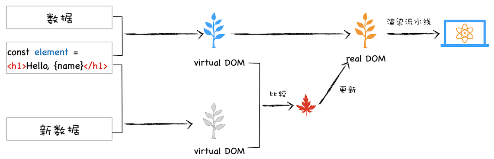

# 虚拟DOM和实际的DOM有何不同

## 真实 DOM 的缺陷

我们可以调用document.body.appendChild(node)往 body 节点上添加一个元素，调用该 API 之后会引发一系列的连锁反应。首先渲染引擎会将 node 节点添加到 body 节点之上，然后触发样式计算、布局、绘制、栅格化、合成等任务，我们把这一过程称为重排。除了重排之外，还有可能引起重绘或者合成操作，形象地理解就是“牵一发而动全身”。另外，对于 DOM 的不当操作还有可能引发强制同步布局和布局抖动的问题，这些操作都会大大降低渲染效率。因此，对于 DOM 的操作我们时刻都需要非常小心谨慎。

## 虚拟 DOM

### 它解决哪些事情

* 将页面改变的内容应用到虚拟 DOM 上，而不是直接应用到 DOM 上。
* 变化被应用到虚拟 DOM 上时，虚拟 DOM 并不急着去渲染页面，而仅仅是调整虚拟 DOM 的内部状态，这样操作虚拟 DOM 的代价就变得非常轻了。
* 在虚拟 DOM 收集到足够的改变时，再把这些变化一次性应用到真实的 DOM 上。

我们就结合这张图来分析下虚拟 DOM 到底怎么运行的。

* **创建阶段**。首先依据 JSX 和基础数据创建出来虚拟 DOM，它反映了真实的 DOM 树的结构。然后由虚拟 DOM 树创建出真实 DOM 树，真实的 DOM 树生成完后，再触发渲染流水线往屏幕输出页面。

* **更新阶段**。如果数据发生了改变，那么就需要根据新的数据创建一个新的虚拟 DOM 树；然后 React 比较两个树，找出变化的地方，并把变化的地方一次性更新到真实的 DOM 树上；最后渲染引擎更新渲染流水线，并生成新的页面。