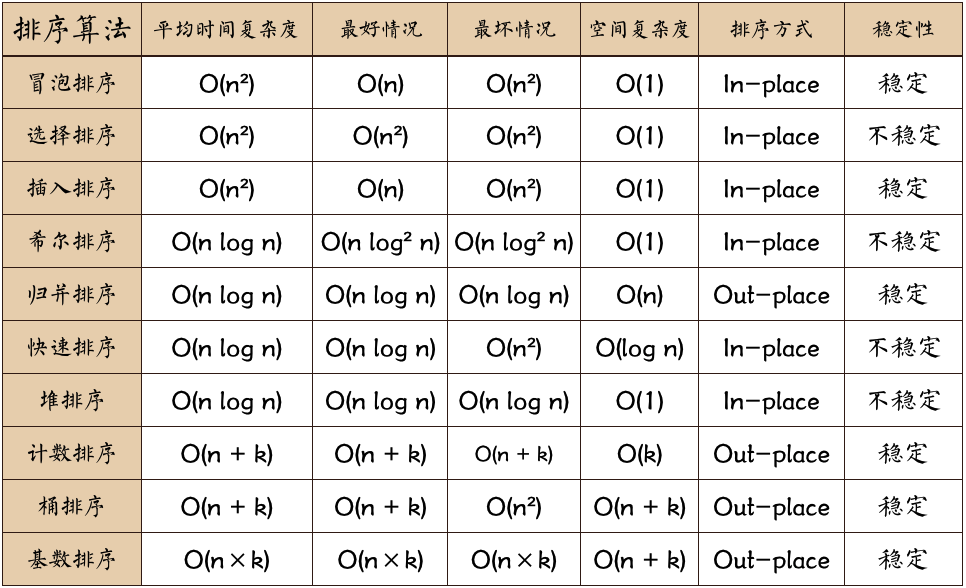

# 基础算法

## 算法优劣术语的说明

**稳定**：如果a原本在b前面，而a=b，排序之后a仍然在b的前面； **不稳定**：如果a原本在b的前面，而a=b，排序之后a可能会出现在b的后面；

**内排序**：所有排序操作都在内存中完成； **外排序**：由于数据太大，因此把数据放在磁盘中，而排序通过磁盘和内存的数据传输才能进行；

**时间复杂度**: 一个算法执行所耗费的时间。 **空间复杂度**: 运行完一个程序所需内存的大小。



**n**: 数据规模 **k**:“桶”的个数 **In-place**: 占用常数内存，不占用额外内存 **Out-place**: 占用额外内存

## 冒泡排序（Bubble Sort）

### 描述

> 冒泡排序是一种简单的排序算法。它重复地走访过要排序的数列，一次比较两个元素，如果它们的顺序错误就把它们交换过来。走访数列的工作是重复地进行直到没有再需要交换，也就是说该数列已经排序完成。这个算法的名字由来是因为越小的元素会经由交换慢慢“浮”到数列的顶端。

算法步骤如下：

1. 比较相邻的元素。如果第一个比第二个大，就交换它们两个；
2. 对每一对相邻元素作同样的工作，从开始第一对到结尾的最后一对，这样在最后的元素应该会是最大的数；
3. 针对所有的元素重复以上的步骤，除了最后一个；
4. 重复步骤1~3，直到排序完成。

### 实现

```js
function bubbleSort(arr) {
    var len = arr.length;
    for (var i = 0; i < len; i++) {
        for (var j = 0; j < len - 1 - i; j++) {
            if (arr[j] > arr[j+1]) {        //相邻元素两两对比
                var temp = arr[j+1];        //元素交换
                arr[j+1] = arr[j];
                arr[j] = temp;
            }
        }
    }
    return arr;
}
var arr=[3,44,38,5,47,15,36,26,27,2,46,4,19,50,48]

// 0.085ms
```

### 改进

> 设置一标志性变量pos,用于记录每趟排序中最后一次进行交换的位置。由于pos位置之后的记录均已交换到位,故在进行下一趟排序时只要扫描到pos位置即可.

```js
function bubbleSort2(arr) {
    var len = arr.length;
    var pos = 0
    for (var i = 0; i < len - pos; i++) {
        ++pos
        for (var j = 0; j < len - 1 - i - pos; j++) {
            if (arr[j] > arr[j+1]) {        //相邻元素两两对比
                var temp = arr[j+1];        //元素交换
                arr[j+1] = arr[j];
                arr[j] = temp;
            }
        }
    }
    return arr;
}

// or 

function bubbleSort2(arr) {
    console.time('改进后冒泡排序耗时');
    var i = arr.length-1;  //初始时,最后位置保持不变
    while ( i> 0) {
        var pos= 0; //每趟开始时,无记录交换
        for (var j= 0; j< i; j++)
            if (arr[j]> arr[j+1]) {
                pos= j; //记录交换的位置
                var tmp = arr[j]; arr[j]=arr[j+1];arr[j+1]=tmp;
            }
        i= pos; //为下一趟排序作准备
     }
     console.timeEnd('改进后冒泡排序耗时');
     return arr;
}

var arr=[3,44,38,5,47,15,36,26,27,2,46,4,19,50,48]

// 0.024ms
```

### 分析

* 最佳情况：当输入的数据已经是正序时 T(n) = O(n) 
* 最差情况：当输入的数据是反序时 T(n) = O(n2)
* 平均情况：T(n) = O(n2)


## 选择排序（Selection Sort）

### 描述

> 首先在未排序序列中找到最小（大）元素，存放到排序序列的起始位置，然后，再从剩余未排序元素中继续寻找最小（大）元素，然后放到已排序序列的末尾。以此类推，直到所有元素均排序完毕。

算法步骤如下：

1. 初始状态：无序区为R[1..n]，有序区为空;
2. 第i趟排序(i=1,2,3...n-1)开始时，当前有序区和无序区分别为R[1..i-1]和R(i..n）。该趟排序从当前无序区中-选出关键字最小的记录 R[k]，将它与无序区的第1个记录R交换，使R[1..i]和R[i+1..n)分别变为记录个数增加1个的新有序区和记录个数减少1个的新无序区;
3. n-1趟结束，数组有序化了

### 实现

```js
function selectionSort(arr) {
    var len = arr.length;
    var minIndex, temp;
    console.time('选择排序耗时');
    for (var i = 0; i < len - 1; i++) {
        minIndex = i;
        for (var j = i + 1; j < len; j++) {
            if (arr[j] < arr[minIndex]) {     //寻找最小的数
                minIndex = j;                 //将最小数的索引保存
            }
        }
        temp = arr[i];
        arr[i] = arr[minIndex];
        arr[minIndex] = temp;
    }
    console.timeEnd('选择排序耗时');
    return arr;
}
var arr=[3,44,38,5,47,15,36,26,27,2,46,4,19,50,48];
```


### 分析

* 最佳情况：T(n) = O(n2)
* 最差情况：T(n) = O(n2)
* 平均情况：T(n) = O(n2)

## 插入排序（Insertion Sort）

### 描述

> 通过构建有序序列，对于未排序数据，在已排序序列中从后向前扫描，找到相应位置并插入。插入排序在实现上，通常采用in-place排序（即只需用到O(1)的额外空间的排序），因而在从后向前扫描过程中，需要反复把已排序元素逐步向后挪位，为最新元素提供插入空间。

算法步骤如下：

1. 从第一个元素开始，该元素可以认为已经被排序；
2. 出下一个元素，在已经排序的元素序列中从后向前扫描；
3. 如果该元素（已排序）大于新元素，将该元素移到下一位置；
4. 重复步骤3，直到找到已排序的元素小于或者等于新元素的位置；
5. 将新元素插入到该位置后；
6. 重复步骤2~5。

### 实现

```js
function insertionSort(array) {
  for (var i = 1; i < array.length; i++) {
      var key = array[i];
      var j = i - 1;
      while (j >= 0 && array[j] > key) {
          array[j + 1] = array[j];
          j--;
      }
      array[j + 1] = key;
  }
  return array;
}
```

### 改进

> 查找插入位置时使用二分查找的方式

```js
function binaryInsertionSort(array) {
  console.time('二分插入排序耗时：');

  for (var i = 1; i < array.length; i++) {
      var key = array[i], left = 0, right = i - 1;
      while (left <= right) {
          var middle = parseInt((left + right) / 2);
          if (key < array[middle]) {
              right = middle - 1;
          } else {
              left = middle + 1;
          }
      }
      for (var j = i - 1; j >= left; j--) {
          array[j + 1] = array[j];
      }
      array[left] = key;
  }
  console.timeEnd('二分插入排序耗时：');

  return array;
}
var arr=[3,44,38,5,47,15,36,26,27,2,46,4,19,50,48];
```


### 分析

* 最佳情况：输入数组按升序排列。T(n) = O(n)
* 最坏情况：输入数组按降序排列。T(n) = O(n2)
* 平均情况：T(n) = O(n2)

## 快速排序（Quick Sort）

### 描述

> 通过一趟排序将待排记录分隔成独立的两部分，其中一部分记录的关键字均比另一部分的关键字小，则可分别对这两部分记录继续进行排序，以达到整个序列有序。

算法步骤如下：

1. 在数据集之中，选择一个元素作为"基准"（pivot）;
2. 所有小于"基准"的元素，都移到"基准"的左边；所有大于"基准"的元素，都移到"基准"的右边;
3. 对"基准"左边和右边的两个子集，不断重复第一步和第二步，直到所有子集只剩下一个元素为止。


### 实现

```js
var quickSort = function(arr) {
　　if (arr.length <= 1) { return arr; }
　　var pivotIndex = Math.floor(arr.length / 2);
　　var pivot = arr.splice(pivotIndex, 1)[0];
　　var left = [];
　　var right = [];
　　for (var i = 0; i < arr.length; i++){
　　　　if (arr[i] < pivot) {
　　　　　　left.push(arr[i]);
　　　　} else {
　　　　　　right.push(arr[i]);
　　　　}
　　}
　　return quickSort(left).concat([pivot], quickSort(right))
}
```


### 分析

* 最佳情况：T(n) = O(nlogn)
* 最差情况：T(n) = O(n2)
* 平均情况：T(n) = O(nlogn)

## 堆排序（Heap Sort）

### 描述

> 堆排序（Heapsort）是指利用堆这种数据结构所设计的一种排序算法。堆积是一个近似完全二叉树的结构，并同时满足堆积的性质：即子结点的键值或索引总是小于（或者大于）它的父节点。

算法步骤如下：

1. 将初始待排序关键字序列(R1,R2....Rn)构建成大顶堆，此堆为初始的无序区;
2. 将堆顶元素R[1]与最后一个元素R[n]交换，此时得到新的无序区(R1,R2,......Rn-1)和新的有序区(Rn),且满足R[1,2...n-1]<=R[n]；
3. 由于交换后新的堆顶R[1]可能违反堆的性质，因此需要对当前无序区(R1,R2,......Rn-1)调整为新堆，然后再次将R[1]与无序区最后一个元素交换，得到新的无序区(R1,R2....Rn-2)和新的有序区(Rn-1,Rn)。不断重复此过程直到有序区的元素个数为n-1，则整个排序过程完成。

### 实现

```js
function swap(arr, a, b) {
    if (a == b) { return; }
    var c = arr[a];
    arr[a] = arr[b];
    arr[b] = c;
}
function heapSort(iArr) {
    var n = iArr.length;
    // 若只有一个或者没有，则返回
    if (n <= 1) { return iArr; }
    // 若有多个，则建最大堆
    else {
        // 建堆（Build-Max-Heap）
        for (var i = Math.floor(n / 2); i >= 0; i--) {
            maxHeapify(iArr, i, n);
        }
        // 堆排序
        for (var j = 0; j < n; j++) {
            swap(iArr, 0, n - 1 - j)
            maxHeapify(iArr, 0, n - 2 - j);
        }
        return iArr;
    }
}
function maxHeapify(Arr, i, size) {
    var l = 2 * i + 1, r = 2 * i + 2; // 左子节点为2i + 1，右子节点为2i + 2
    var largest = i;
    // 若子节点比节点大，则标记
    if (l <= size && Arr[l] > Arr[largest]) {
        largest = l;
    }
    if (r <= size && Arr[r] > Arr[largest]) {
        largest = r;
    }
    // 若标记有子节点，则交换父子位置，并递归计算
    if (largest !== i) {
        swap(Arr, i, largest);
        maxHeapify(Arr, largest, size);
    }
}
```


### 分析

* 最佳情况：T(n) = O(nlogn)
* 最差情况：T(n) = O(nlogn)
* 平均情况：T(n) = O(nlogn)