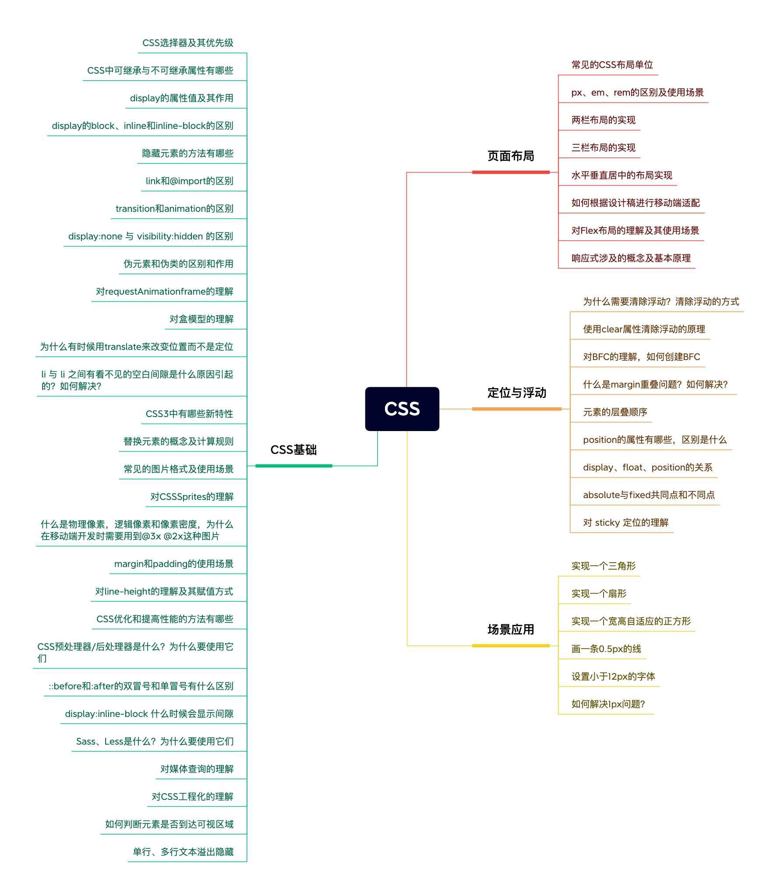

# CSS

 

## CSS基础

### 1. CSS选择器及其优先级

| 选择器 | 格式 | 优先级权重 |
| --- | --- | --- |
| 内联样式 | style="color: red;" | 1000 |
| id选择器 | #id | 100 |
| 类选择器 | .class | 10 |
| 属性选择器 | a[ref = "eee"] | 10 |
| 伪类选择器 | li:last-child | 10 |
| 标签选择器 | div | 1 |
| 伪元素选择器 | li:after | 1 |
| 相邻兄弟选择器 | h1 + p | 0 |
| 子选择器 | ul > li | 0 |
| 后代选择器 | li a | 0 |
| 通配符选择器 | * | 0 |

- !important 声明的样式优先级最高
- 如果优先级相同，最后出现的样式生效
- 集成得到的样式优先级最低
- 样式表的来源不同时，优先级顺序为：内联样式 > 内部样式 > 外部样式 > 浏览器用户自定义样式 > 浏览器默认样式。
- 在计算优先级时，选择器中每个部分的数量都会被考虑。例如，div p 的优先级比 p 高，因为它包含了更多的选择器部分。

### 2. CSS中可继承与不可继承属性有哪些

<b>一、无继承性的属性</b>

1. `display`：规定元素应该生成的框的类型

2. 文本属性

- `vertical-align`：垂直文本对齐
- `text-decoration`：规定添加到文本的装饰
- `text-shadow`：文本阴影
- `white-space`：空白符处理
- `unicode-bidi`：文本方向

3. 盒子模型的属性

`width`、`height`、`margin`、`border`、`padding`

4. 背景属性：

`background`、`background-color`、`background-image`、`background-repeat`、`background-pisition`、`background-attachment`

5. 定位属性：
`float`、`clear`、`position`、`top`、`right`、`bottom`、`left`、`min-width`、`min-height`、`max-width`、`max-height`、`overflow`、`clip`、`z-index`

6. 生成内容属性：
`content`、`counter-reset`、`counter-increment`

7. 轮廓样式属性：
`outline-style`、`outline-width`、`outline-color`、`outline`

8. 页面样式属性：
`size`、`page-break-before`、`page-break-after`

9. 声音样式属性：
`pause-before`、`pause-after`、`pause`、`cue-before`、`cue-after`、`cue`、`play-during`

<b>二、有继承性的属性</b>

1. 字体属性

- `font-family`：字体系列
- `font-weight`：字体的粗细
- `font-size`：字体的大小
- `font-style`：字体的风格

2. 文本属性

- `text-indent`：文本缩进
- `text-align`：文本水平对齐
- `line-height`：行高
- `word-spacing`：单词之间的间距
- `letter-spacing`：中文或者字母之间的间距
- `text-transform`：控制文本大小写（就是uppercase、lowercase、capitalize这三个）
- `color`：文本颜色

3. 元素可见性

- `visibility`：控制元素显示隐藏

4. 列表布局属性

- `list-style`：列表风格，包括list-style-type、list-style-image等

5. 光标属性

- `cursor`：光标显示为何种形态

### 3. display 的属性值及其作用

| 属性值 | 作用 |
| --- | --- |
| none | 元素不显示，并且会从文档流中移除。 |
| block | 块类型。默认宽度为父元素宽度，可设置宽高，换行显示。|
| inline | 行内元素类型。默认宽度为内容宽度，不可设置宽高，同行显示。 |
| inline-block | 默认宽度为内容宽度，可以设置宽高，同行显示。 |
| list-item | 像块类型元素一样显示，并添加样式列表标记。 |
| table | 此元素会作为块级表格来显示。 |
| inherit | 规定应该从父元素继承display属性的值。 |

### 4. display 的 block、inline 和 inline-block 的区别

<b>`block`：</b>

- 元素独占一行，从上至下垂直排列
- 宽度默认为父元素的100%，可以设置宽度和高度
- 常见的块级元素有 `<div>`、`<p>`、`<h1>` 等

```css
.block-element {
  display: block;
  width: 100%; /* 默认宽度为父元素宽度 */
  height: 50px; /* 可设置高度 */
}
```

<b>`inline`：</b>

- 元素在同一行内水平排列，不独占一行
- 宽度和高度仅占据内容所需的空间
- 不能设置宽度和高度
- 常见的行内元素有 `<span>`、`<a>`、`<strong>` 等

```css
.inline-element {
  display: inline;
  /* 不能设置宽度和高度 */
}
```

<b>`inline-block`：</b>

- 元素在同一行内水平排列，但可以设置宽度和高度
- 宽度和高度仅占据内容所需的空间
- 常用于需要水平排列但同时设置宽度和高度的情况
- 允许元素有块级元素的宽度和高度属性

```css
.inline-block-element {
  display: inline-block;
  width: 50px;
  height: 50px;
}
```

### 5. 隐藏元素的方法有哪些

常见的6种方式：

- `display: none`：将元素完全从页面中移除，不占据任何空间，元素及其子元素都会隐藏
- `visibility: hidden`：元素在页面上不可见，但仍然占据空间，元素及其子元素仍然存在于文档流中
- `opacity: 0`：使元素完全透明，但仍然占据空间，元素及其子元素仍然存在于文档流中
- `position: absolute | fixed`：通过设置 left 或 right 来将元素移出可视区域
- `clip: rect(0, 0, 0, 0)`：将元素裁剪为不可见的区域，该属性已被废弃，不推荐使用
- `transform: scale(0,0)`：将元素缩放为 0，但仍然占据空间，元素及其子元素仍然存在于文档流中

### 6. link和@import的区别

<b>1. 语法和用法</b>

- `<link>`：HTML标签，用于在 HTML 中引入外部资源，如 CSS 文件、favicon、字体文件等。
```html
<link rel="stylesheet" type="text/css" href="styles.css">
```

- `@import`：CSS 的一种指令，用于在 CSS 文件中引入其他 CSS 文件。
```css
@import url("styles.css")
```

<b>2. 加载方式</b>

- `<link>`：标签会在页面加载时同时加载外部资源，并行请求，不会阻塞页面渲染。
- `@import`：指令会在页面加载后加载样式表，会等待 HTML 页面加载完毕后再加载，可能会阻塞页面的渲染（下面介绍）。

<b>3. 兼容性</b>

- `<link>`：HTML 的标准元素，支持所有现代浏览器，也支持旧版本浏览器。
- `@import`：CSS2.1 引入的特性，不支持 IE5和IE6，虽然现代浏览器都支持，但有时候会引发一些兼容性问题。

<b>4. 使用场景</b>

- `<link>`：更常用于在 HTML 文件中引入外部样式表，以及引入网站图标、字体文件等。
- `@import`：通常用于在 CSS 文件中引入其他 CSS 文件，例如在模块化开发中，或者在某些特定场景下需要动态加载 CSS 的情况。


#### @import阻塞页面渲染的情况

- 当页面包含多个 `@import` 指令时，浏览器需要等待所有样式表加载完成后才能开始渲染页面内容，这可能导致页面加载速度变慢，用户感知到的页面加载时间延长。
- 如果某个 `@import` 指向的样式表文件很大或者网络情况不佳，那么加载该样式表可能会花费较长的时间，延迟页面的渲染。
- `@import`指令是顺序加载的，即使在 CSS 文件中使用了异步加载也不会生效。如果某个样式表加载时间较长，后续的页面渲染会被阻塞。

虽然 `@import` 指令有可能会影响页面的加载和渲染速度，但具体影响程度取决于多个因素，包括网络情况、样式表大小、样式表加载顺序等。在实际开发中，为了提升页面加载性能，可以尽量减少 `@import` 的使用，或者将 `@import` 放置在页面底部，以减少其对页面渲染的阻塞。

### 7. transition和animation的区别

<b>1. 触发方式</b>

- `transition` 是通过改变元素的 CSS 属性值来触发动画效果的，通常是在元素状态变化时（例如鼠标悬停、焦点获取等）。
- `animation` 是通过关键帧（keyframes）来定义动画效果，并通过将动画应用于元素来触发动画。

<b>2. 定义方式</b>

- `transition` 通过设置元素的 transition 属性来定义动画效果，指定需要过渡的属性、持续时间、过渡效果等。
- `animation` 通过 @keyframes 规则来定义动画效果，然后将动画效果应用于元素，并设置动画的持续时间、动画播放次数、动画延迟等。

<b>3. 适用对象</b>

- `transition` 适用于在两种状态之间过渡的简单动画效果，例如颜色渐变、尺寸变化等。
- `animation` 更适用于复杂的动画效果，可以定义更多的关键帧和动画参数，实现更复杂的动画效果。

<b>4. 动画控制</b>

- `transition` 主要是在元素状态变化时触发动画，并且只有简单的动画控制（如过渡时间、过渡效果等）。
- `animation` 具有更多的动画控制选项，可以控制动画的播放次数、播放方向、播放速度等。

总结：`transition` 是过渡属性，强调过度。`animation` 是动画属性，它的实现不需要触发事件，设定好时间之后可以自己执行。

### 8. display:none 与 visibility:hidden 的区别

<b>1. 元素在文档流中的影响</b>

- `display` 元素会从文档流中完全移除，不占据任何空间，相当于元素不存在。周围的元素会像该元素不存在一样布局。
- `visibility` 元素仍然占据文档流中的位置，只是不可见，相当于元素仍然存在，但看不见。

<b>2. 可访问性</b>

- `display` 隐藏的元素对于屏幕阅读器和搜索引擎来说是不可访问的，它们不会将其内容视为可用。
- `visibility` 隐藏的元素对于屏幕阅读器和搜索引擎来说是可访问的，它们会将其内容视为可用。

<b>3. 动画和过渡</b>

- `display` 不能使用过渡或动画效果来改变元素的显示状态，因为元素不在文档流中，所以无法应用这些效果。
- `visibility` 可以使用过渡或动画效果来改变元素的可见性，因为元素仍然存在于文档流中。

<b>4. 性能影响</b>

- `display` 性能消耗较高，因为每次都需要重新计算布局（重排）。
- `visibility` 性能消耗较低，因为元素仍然占据着空间，不需要重新计算布局（重绘）。

### 9. 伪元素和伪类的区别和作用

<b>1. 伪元素（pseudo-elements）</b>

- 伪元素用于在文档中创建一些不在 DOM 中存在的虚拟元素，并对这些虚拟元素进行样式设置。
- 伪元素由 `::` 开头。例如 `::before`、`::after`、`::first-letter`、`::first-line`。
- 伪元素可以用来在元素的内容前后插入额外的内容，例如用来创建一些装饰性的元素或者清除浮动。

```css
p::before { content: "::"; }
p::after { content: "**"; }
p::first-line { background: red; }
p::first-letter { font-size: 24px; }
```

<b>2. 伪类（pseudo-classes）</b>

- 伪类用于向元素添加特殊的状态，例如鼠标悬停、被选中等。
- 伪类以单冒号 `:` 开头，例如 `:hover`、`:checked` 等。
- 伪类主要用于根据用户操作或元素的状态改变样式，例如鼠标悬停时改变链接的颜色。

```css
a:hover { color: red; }
p:first-child { color: red; }
```

### 10. 对 requestAnimationFrame 的理解

实现动画效果的方法比较多，Javascript 中可以通过定时器 setTimeout 来实现，CSS3 中可以使用 transition 和 animation 来实现，HTML5 中的 canvas 也可以实现。除此之外，HTML5 提供一个专门用于请求动画的API，那就是 requestAnimationFrame，顾名思义就是<b>请求动画帧</b>。

**语法：** `window.requestAnimationFrame(callback)`  其中，callback是<b>下一次重绘之前更新动画帧所调用的函数</b>。该回调函数会被传入DOMHighResTimeStamp参数，它表示requestAnimationFrame() 开始去执行回调函数的时刻。该方法属于宏任务，所以会在执行完微任务之后再去执行。

**取消动画：** 使用 cancelAnimationFrame() 来取消执行动画，该方法接收一个参数——requestAnimationFrame默认返回的id，只需要传入这个id就可以取消动画了。

**requestAnimationFrame 优势**

- <b>节省资源：</b>使用SetTinterval 实现的动画，当页面被隐藏或最小化时，SetTinterval 仍然在后台执行动画任务，由于此时页面处于不可见或不可用状态，刷新动画是没有意义的，完全是浪费CPU资源。而RequestAnimationFrame则完全不同，当页面处理未激活的状态下，该页面的屏幕刷新任务也会被系统暂停，因此跟着系统走的RequestAnimationFrame也会停止渲染，当页面被激活时，动画就从上次停留的地方继续执行，有效节省了CPU开销。
- <b>自适应刷新率：</b>在高频率事件( resize, scroll 等)中，为了防止在一个刷新间隔内发生多次函数执行，RequestAnimationFrame可保证每个刷新间隔内，函数只被执行一次，这样既能保证流畅性，也能更好的节省函数执行的开销，一个刷新间隔内函数执行多次时没有意义的，因为多数显示器每16.7ms刷新一次，多次绘制并不会在屏幕上体现出来。
- <b>更好的性能：</b>requestAnimationFrame 会把每一帧中的所有DOM操作集中起来，在一次重绘或回流中就完成，并且重绘或回流的时间间隔紧紧跟随浏览器的刷新频率，一般来说，这个频率为每秒60帧。浏览器会在每一帧开始前优先调用回调函数，确保动画的流畅性和性能。

**setTimeout执行动画的缺点**

- 它通过设定间隔时间来不断改变图像位置，达到动画效果。但是容易出现卡顿、抖动的现象；
- setTimeout 任务被放入异步队列，只有当主线程任务执行完后才会执行队列中的任务，因此实际执行时间总是比设定时间要晚；
- setTimeout 的固定时间间隔不一定与屏幕刷新间隔时间相同，会引起丢帧；

```js
et requestId;
let element = document.getElementById('myElement');
let position = 0;

function moveElement() {
  position += 1;
  element.style.left = position + 'px';
  if (position < 100) {
    requestId = requestAnimationFrame(moveElement);
  }
}

function startAnimation() {
  requestId = requestAnimationFrame(moveElement);
}

function stopAnimation() {
  cancelAnimationFrame(requestId);
}

// 开始动画
startAnimation();

// 模拟停止动画
setTimeout(stopAnimation, 3000); // 模拟停止动画的时间为3秒后
```

### 11. 对盒模型的理解

盒模型包含了元素的**内容（content）**、**内边距（padding）**、**边框（border）**和**外边距（margin）**四个部分。

- <b>内容区域（content）：</b> 这部分包含了元素的实际内容，例如文本、图片等。内容的宽度和高度可以通过 width 和 height 属性进行设置。
- <b>内边距（padding）：</b> 内边距是内容区域与边框之间的空白区域，用于控制内容与边框的距离。内边距的大小可以通过 padding 属性进行设置。
- <b>边框（border）：</b> 边框是围绕在内容和内边距外部的线条，用于装饰元素并将其与周围内容区分开。边框的样式、宽度和颜色可以通过 border 属性进行设置。
- <b>外边距（margin）：</b> 外边距是元素边框外部的空白区域，用于控制元素与其他元素之间的距离。外边距的大小可以通过 margin 属性进行设置。

**可以通过修改元素的box-sizing属性来改变元素的盒模型**
- `box-sizing: content-box` 表示标准盒模型（默认值），width和height属性的范围只包含了content。
- `box-sizing: border-box` 表示IE盒模型（怪异盒模型），width和height属性的范围包含了border、padding和content。

### 12. 为什么有时候用 translate 来改变位置而不是定位

<b>定位</b>

使用 `position` 属性可以将元素定位在页面上的特定位置，可以通过设置 `top、right、bottom、left` 等属性来调整元素的位置。

- 优点：定位可以精确地控制元素的位置，可以在文档流中脱离元素，并且可以使用 `z-index` 控制元素的堆叠顺序。
- 缺点：使用定位可能会破坏元素原本在文档流中的位置，可能需要手动调整元素之间的间距，同时定位的元素可能会影响其他元素的布局。

<b>transform 中的 translate</b>

使用 `transform: translate(x, y)`; 可以将元素沿着 x 和 y 轴移动指定的距离，而不会影响元素在文档流中的位置。

- 优点：使用 `translate` 可以实现流畅的动画效果，因为移动是由 GPU 加速的，性能较好。而且移动的元素不会影响其他元素的布局。
- 缺点：`translate` 不会改变元素在文档流中的位置，所以如果需要改变元素在文档流中的位置，还是需要使用定位。