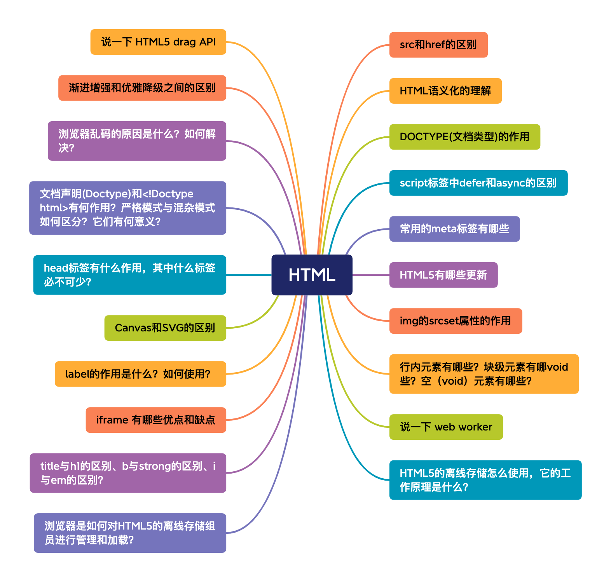

# HTML

 

## src 和 href 的区别

1. src（source）属性：

* `src` <b>属性用于指定外部资源</b>，比如图像、音频、视频或者脚本文件等。它告诉浏览器从指定的路径获取资源，并将其嵌入到文档中。

```html

<script src="script.js"></script>
```

2. href（hypertext reference）属性：

* `href` <b>属性用于建立当前元素与外部资源之间的链接。</b>它通常用于超链接，指向其他文档、样式表、图像、应用程序等

```html
<a href="https://www.example.com">Visit Example</a>
<link rel="stylesheet" href="style.css">
```

在 HTML 中，有一些元素可能同时支持 `src` 和 `href` 属性，这通常取决元素的类型和在文档中的角色

```html
<a href="https://www.example.com" src="image.jpg">Visit Example</a>
<link rel="stylesheet" href="style.css" src="icon.png">
<script src="script.js" href="fallback-script.js"></script>
```

## HTML 语义化的理解

<b>语义化是指根据内容的结构化（内容的语义化），选择合适的标签（代码语义化）</b>

语义化的优点如下：

* 对机器友好，带有语义的文字表现力丰富，更适合搜索引擎的爬虫爬取有效信息，有利于 SEO。除此之外，语义类还支持读屏软件，根据文章可以自动生成目录；
* 对开发者友好，使用语义类标签增强了可读性，结构更加清晰，开发者能清晰的看出网页的结构，便于团队的开发与维护。

常见语义化标签

```javascript
<header></header> // 头部

<nav></nav> // 导航栏

<section></section> // 区块（有语义化的div）

<main></main> // 主要区域

<article></article> // 主要内容

<aside></aside> // 侧边栏

<footer></footer> // 底部
```

## DOCTYPE（文档类型）的作用

DOCTYPE 是 HTML5 中一个标准通过标记语言的文档类型声明，它的目的是告诉浏览器（解析器）应该以什么样（html或xhtml）的文档类型定义来解析文档，不同的渲染模式会影响浏览器对 css 代码甚至 JavaScript 脚本的解析。它必须声明在 HTML 文档的第一行。

```html
<!DOCTYPE html>
```

浏览器渲染页面时有两种主要的模式，即标准模式（standards mode） 和混杂模式（quirks mode）。这两种模式的选择通常由文档的`<!DOCTYPE>`声明来确定。可以通过 `document.compatMode` 查看。

* 标准模式（standards mode）：CSS1Compat，浏览器使用W3C的标准解析渲染页面。文档开头包含了严格的 `<!DOCTYPE>` 声明；
* 混杂模式（quirks mode）：BackCompat，浏览器使用自己的怪异模式解析渲染页面。文档开头不包含了严格的 `<!DOCTYPE>` 声明；

