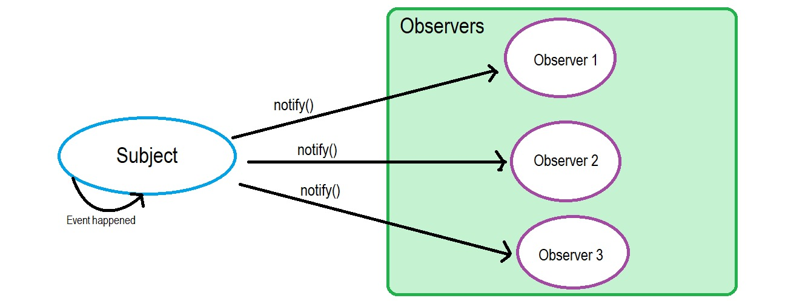
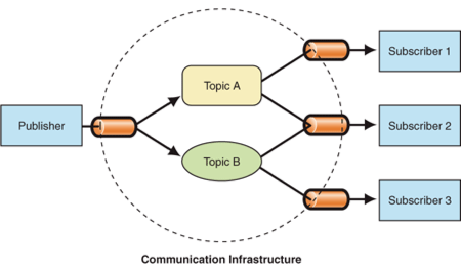
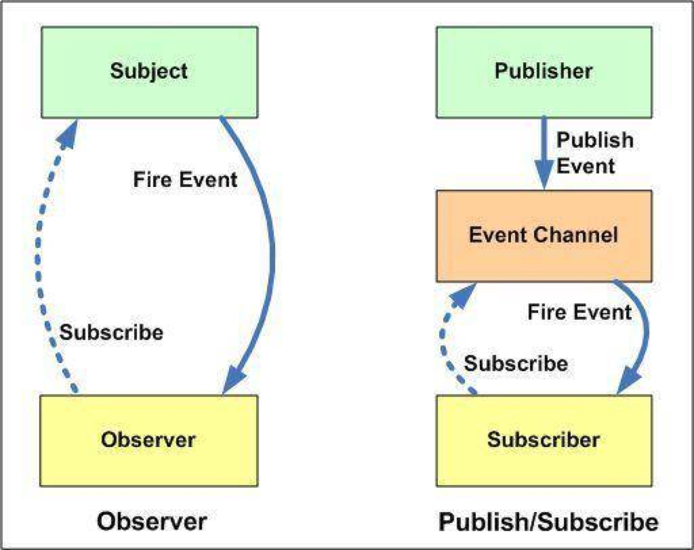

# 设计模式

## 观察者模式

> 一个目标对象管理所有相依于它的观察者对象，并且在它本身的状态改变时主动发出通知。这通常透过呼叫各观察者所提供的方法来实现。此种模式通常被用来实时事件处理系统。

**简单来说，观察者模式就是，一个对象（被观察者）的状态发生改变时，会通知所有依赖它的对象（观察者），这两者是直接关联的。(好比吃饭取号，等位子)**

 

如图所示，当Subject(被观察对象)状态发生变化时，会给所有的Observers(观察者们)发送一个通知函数，观察者们接收到通知后通常会调用各自的更新函数。

```js
const Subject = (() => {
  const observers = []
  const addOb = (ob) => {
    observers.push(ob)
  }
  const notify = () => {
    for (let ob of observers) {
      if (typeof ob.update === 'function') {
        ob.update()
      }
    }
  }
  return { addOb, notify }
})()

let subA = {
  update: () => {
    console.log('updateSubA')
  }
}
let subB = {
  update: () => {
    console.log('updateSubB')
  }
}

Subject.addOb(subA)    //添加观察者subA
Subject.addOb(subB)    //添加观察者subB
Subject.notify()       //通知所有观察者
```

## 发布订阅模式

> 消息的发送者（称为发布者）不会将消息直接发送给特定的接收者（称为订阅者）。而是将发布的消息分为不同的类别，无需了解哪些订阅者（如果有的话）可能存在。同样的，订阅者可以表达对一个或多个类别的兴趣，只接收感兴趣的消息，无需了解哪些发布者（如果有的话）存在。

**发布者状态更新时，发布某些类型的通知，只通知订阅了相关类型的订阅者。发布者和订阅者之间是没有直接关联的。**



如上图所示，发布者与订阅者直接不是互相依赖和关联的，两者之间有一个通信结构（事件通道）。这个事件通道会处理发布者发布的不同类型的通知，并且将这些通知发送给相应的订阅者。


```js
const PubSub = (() => {
  const topics = {}  //保存订阅主题
  const subscribe = (type, fn) => {   //订阅某类型主题
    if (!topics[type]) {
      topics[type] = []
    }
    topics[type].push(fn)
  }
  const publish = (type, ...args) => {    //发布某类型主题
    if (!topics[type]) {
      return
    }
    for (let fn of topics[type]) {      //通知相关主题订阅者
      fn(args)
    }
  }
  return { subscribe, publish }
})()

let subA = {type: 'event1'},
    subB = {type: 'event2'},
    subC = {type: 'event1'}
PubSub.subscribe(subA.type, () => console.log(`update eventType: ${subA.type} subA`))   //订阅者A订阅topic1
PubSub.subscribe(subB.type, () => console.log(`update eventType: ${subB.type} subB`))   //订阅者B订阅topic2
PubSub.subscribe(subC.type, () => console.log(`update eventType: ${subC.type} subC`))   //订阅者C订阅topic1
PubSub.publish(subA.type)  //发布topic通知，通知订阅者A、C
```

## 观察者 与 发布订阅 对比

广义上来说，观察者模式和发布-订阅模式，都是一个对象的状态发生变化，通知相关联的对象。所以广义上来说，这两种模式是相似的，正如《Head First设计模式》所说。**发布 + 订阅 = 观察者模式**



先来看一张图，左边是观察者模型，右边是发布-订阅者模型。结合这个图和上文的分析，我们可以总结下这两者的区别。

* 观察者模式中，被观察者（可理解为发布者）与观察者（可理解为订阅者），这两者之间是直接关联、互相依赖的。而发布-订阅模式中，发布者与订阅者是不直接关联的，它们之间多了一个事件通道，通过这个事件通道把发布者和订阅者关联起来。
* 观察者模式中，被观察者发布通知，所有观察者都会收到通知。发布-订阅模式中，发布者发布通知，只有特定类型的订阅者会收到通知。
* 观察者模式中，被观察者发出状态更新通知后，观察者调用自身内部的更新方法。发布-订阅模式中，订阅者的更新是通过事件通道进行细节处理和响应更新的。