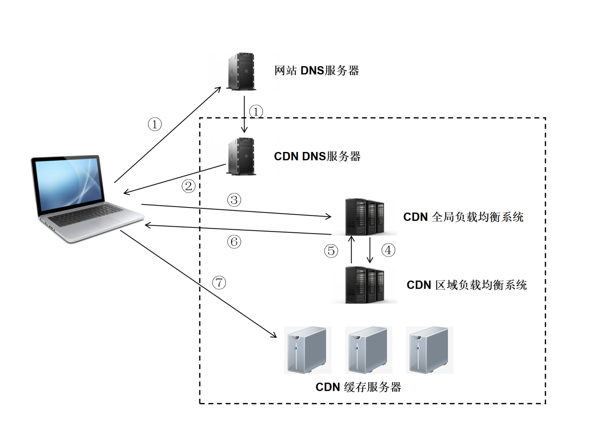

# CDN

## 概念

CDN（Content Delivery Network，**内容分发网络**）是指一种通过互联网互相连接的电脑网络系统，利用最靠近每位用户的服务器，更快、更可靠地将音乐、图片、视频、应用程序及其他文件发送给用户，来提供高性能、可扩展性及低成本的网络内容传递给用户。

典型的CDN系统由下面三个部分组成：

* **分发服务系统**：最基本的工作单元就是Cache设备，cache（边缘cache）负责直接响应最终用户的访问请求，把缓存在本地的内容快速地提供给用户。同时cache还负责与源站点进行内容同步，把更新的内容以及本地没有的内容从源站点获取并保存在本地。Cache设备的数量、规模、总服务能力是衡量一个CDN系统服务能力的最基本的指标。
* **负载均衡系统**：主要功能是负责对所有发起服务请求的用户进行访问调度，确定提供给用户的最终实际访问地址。两级调度体系分为**全局负载均衡**（GSLB）和**本地负载均衡**（SLB）。全局负载均衡主要根据用户就近性原则，通过对每个服务节点进行“最优”判断，确定向用户提供服务的cache的物理位置。本地负载均衡主要负责节点内部的设备负载均衡
* **运营管理系统**：运营管理系统分为运营管理和网络管理子系统，负责处理业务层面的与外界系统交互所必须的收集、整理、交付工作，包含客户管理、产品管理、计费管理、统计分析等功能。

## 作用

CDN一般会用来托管Web资源（包括文本、图片和脚本等），可供下载的资源（媒体文件、软件、文档等），应用程序（门户网站等）。使用CDN来加速这些资源的访问。

1. 在**性能方面**，引入CDN的作用在于：
  * 用户收到的内容来自最近的数据中心，延迟更低，内容加载更快
  * 部分资源请求分配给了CDN，减少了服务器的负载

2. 在**安全方面**，CDN有助于防御DDoS、MITM等网络攻击：
  * 针对DDoS：通过监控分析异常流量，限制其请求频率
  * 针对MITM：从源服务器到 CDN 节点到 ISP（Internet Service Provider），全链路 HTTPS 通信
除此之外，CDN作为一种基础的云服务，同样具有资源托管、按需扩展（能够应对流量高峰）等方面的优势。

## 原理

CDN和DNS有着密不可分的联系，先来看一下DNS的解析域名过程，在浏览器输入 www.test.com 的解析过程如下：

### DNS解析过程

1. 检查浏览器缓存
2. 检查操作系统缓存，常见的如hosts文件
3. 检查路由器缓存
4. 如果前几步都没没找到，会向ISP(网络服务提供商)的LDNS服务器查询
5. 如果LDNS服务器没找到，会向根域名服务器(Root Server)请求解析，分为以下几步：
* 根服务器返回顶级域名(TLD)服务器如 `.com`，`.cn`，`.org` 等的地址，该例子中会返回 `.com` 的地址
* 接着向顶级域名服务器发送请求，然后会返回次级域名(SLD)服务器的地址，本例子会返回 `.test` 的地址
* 接着向次级域名服务器发送请求，然后会返回通过域名查询到的目标IP，本例子会返回 `www.test.com` 的地址
* Local DNS Server会缓存结果，并返回给用户，缓存在系统中

### CDN工作原理

1. 用户未使用CDN缓存资源的过程：
* 浏览器通过DNS对域名进行解析（就是上面的DNS解析过程），依次得到此域名对应的IP地址
* 浏览器根据得到的IP地址，向域名的服务主机发送数据请求
* 服务器向浏览器返回响应数据

2. 用户使用CDN缓存资源的过程：
* 对于点击的数据的URL，经过本地DNS系统的解析，发现该URL对应的是一个CDN专用的DNS服务器，DNS系统就会将域名解析权交给CNAME指向的CDN专用的DNS服务器。
* CND专用DNS服务器将CND的全局负载均衡设备IP地址返回给用户
* 用户向CDN的全局负载均衡设备发起数据请求
* CDN的全局负载均衡设备根据用户的IP地址，以及用户请求的内容URL，选择一台用户所属区域的区域负载均衡设备，告诉用户向这台设备发起请求
* 区域负载均衡设备选择一台合适的缓存服务器来提供服务，将该缓存服务器的IP地址返回给全局负载均衡设备
* 全局负载均衡设备把服务器的IP地址返回给用户
* 用户向该缓存服务器发起请求，缓存服务器响应用户的请求，将用户所需内容发送至用户终端。

如果缓存服务器没有用户想要的内容，那么缓存服务器就会向它的上一级缓存服务器请求内容，以此类推，直到获取到需要的资源。最后如果还是没有，就会回到自己的服务器去获取资源。

 

:::tip
CNAME（意为：别名）：在域名解析中，实际上解析出来的指定域名对应的IP地址，或者该域名的一个CNAME，然后再根据这个CNAME来查找对应的IP地址。
:::

### CDN的使用场景

1. 使用第三方的CDN服务：如果想要开源一些项目，可以使用第三方的CDN服务
2. 使用CDN进行静态资源的缓存：将自己网站的静态资源放在CDN上，比如js、css、图片等。可以将整个项目放在CDN上，完成一键部署。
3. 直播传送：直播本质上是使用流媒体进行传送，CDN也是支持流媒体传送的，所以直播完全可以使用CDN来提高访问速度。CDN在处理流媒体的时候与处理普通静态文件有所不同，普通文件如果在边缘节点没有找到的话，就会去上一层接着寻找，但是流媒体本身数据量就非常大，如果使用回源的方式，必然会带来性能问题，所以流媒体一般采用的都是主动推送的方式来进行。

