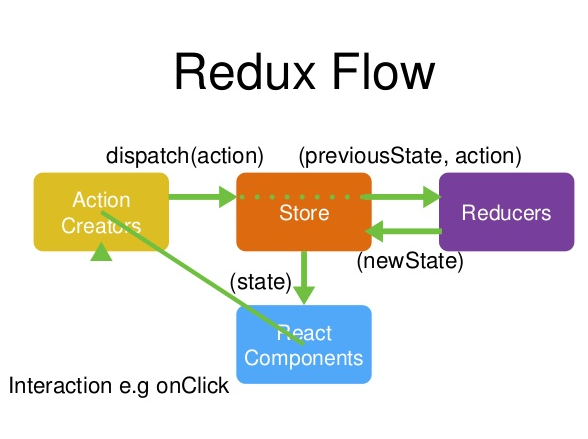

## 工作流程

首先，用户发送 Action。

```js
store.dispatch(action)
```

然后，Store 自动调用 Reducer, 并且传入两个参数：当前 State 和收到的 Action。Reducer 会返回新的 State。

```js
let nextState = todoApp(previousState, action)
```

State 一旦发生变化，Store 就会调用监听函数。

```js
// 设置监听函数
store.subscribe(listener)
```

listener 可以通过 store.getState() 得到当前状态。如果使用的是 React, 这时可以出发重新渲染 View。

```js
function listerner() {
  let newState = store.getState()
  component.setState(newState) 
}
```

## 基本概念

### Store

Store 就是保存数据的地方，你可以把它看成一个容器。**整个应用只能有一个 Store。**

Redux 提供 `createStore` 这个函数，用来生成 Store。

```js
import { createStore } from 'redux'
const store = createStore(fn)
```

上面代码中，`createStore` 函数接受另一个函数作为参数，返回新生成的 Store 对象。

### State

`Store` 对象包含所有数据。如果想得到某个时点的数据，就要对 Store 生成快照。这种时点的数据集合，就叫做 State。

当前时刻的 State，可以通过 `store.getState()` 拿到。

```js
import { createStore } from 'redux'
const store = createStore(fn)

const state = store.getState()
```

Redux 规定， 一个 State 对应一个 View。只要 State 相同，View 就相同。你知道 State，就知道 View 是什么样，反之亦然。

### Action

State 的变化，会导致 View 的变化。但是，用户接触不到 State，只能接触到 View。所以，State 的变化必须是 View 导致的。Action 就是 View 发出的通知，表示 State 应该要发生变化了。

Action 是一个对象。其中的 `type` 属性是必须的，表示 Action 的名称。其他属性可以自由设置，社区有一个[规范](https://github.com/acdlite/flux-standard-action)可以参考。

```js
const action = {
  type: 'ADD_TODO',
  payload: 'Learn Redux'
}
```

上面代码中，Action 的名称是 `ADD_TODO`，它携带的信息是字符串 `Learn Redux`。

可以这样理解，Action 描述当前发生的事情。改变 State 的唯一办法，就是使用 Action。它会运送数据到 Store。

### store.dispatch()

store.dispatch() 是 View 发出 Action 的唯一方法。

```js
import { createStore } from 'redux'
const store = createStore(fn)

store.dispatch({
  type: 'ADD_TODO',
  payload: 'Learn Redux'
})
```

上面代码中，store.dispatch 接受一个 Action 对象作为参数，将它发送出去。

### Reducer

Store 收到 Action 以后，必须给出一个新的 State，这样 View 才会发生变化。这种 State 的计算过程就叫做 Reducer。

Reducer 是一个函数，它接受 Action 和当前 State 作为参数，返回一个新的 State。

```js
const reducer = function (state, action) {
  // ...
  return new_state
}
```

整个应用的初始状态，可以作为 State 的默认值。下面是一个实际的例子。

```js
const defaultState = 0
const reducer = (state = defaultState, action) => {
  switch (action.type) {
    case 'ADD':
      return state + action.payload
    default: 
      return state;
  }
}

const state = reducer(1, {
  type: 'ADD',
  payload: 2
})
```

上面代码中，reducer 函数收到名为 ADD 的 Action 以后，就返回一个新的 State，作为加法的计算结果。其他运算的逻辑（比如减法），也可以根据 Action 的不同来实现。

实际应用中，Reducer 函数不用像上面这样手动调用，store.dispatch 方法会触发 Reducer 的自动执行。为此，Store 需要知道 Reducer 函数，做法就是在生成 Store 的时候，将 Reducer 传入 createStore 方法。

```js
import { createStore } from 'redux'
const store = createStore(reducer)
```

上面代码中，createStore 接受 Reducer 作为参数，生成一个新的 Store。以后每当 store.dispatch 发送过来一个新的 Action，就会自动调用 Reducer，得到新的 State。

### store.subscribe()

Store 允许使用store.subscribe方法设置监听函数，一旦 State 发生变化，就自动执行这个函数。

```js
import { createStore } from 'redux'
const store = createStore(reducer)

store.subscribe(listener)
```

显然，只要把 View 的更新函数（对于 React 项目，就是组件的 render 方法或 setState 方法）放入 listen，就会实现 View 的自动渲染。

store.subscribe 方法返回一个函数，调用这个函数就可以解除监听。

```js
let unsubscribe = store.subscribe(() =>
  console.log(store.getState())
)

unsubscribe()
```

## redux 示例

[更多示例](https://github.com/reduxjs/redux/tree/master/examples)