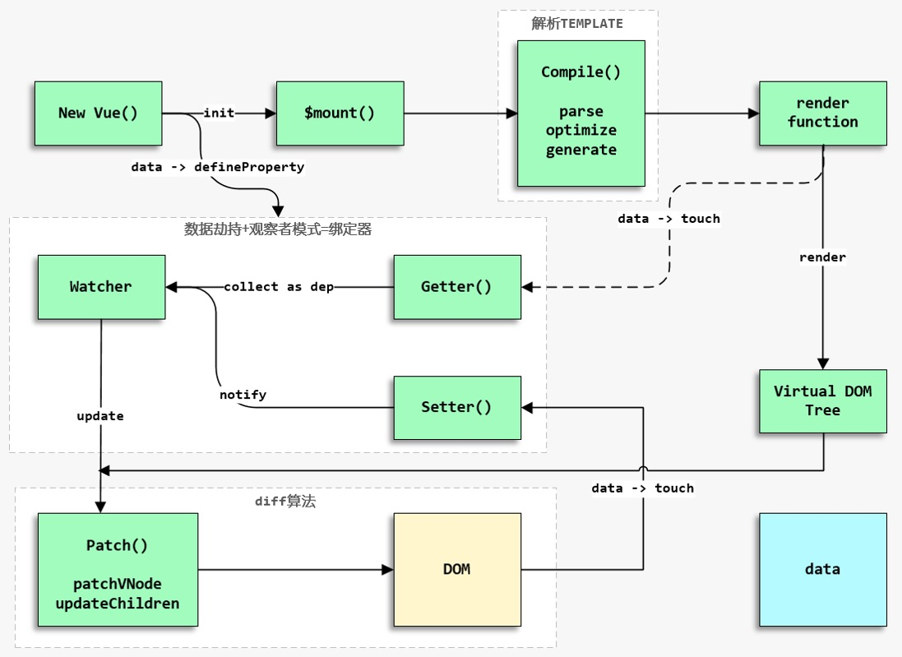

# Vue 实现原理

 

1. 创建 Vue 实例对象;
2. `init`过程会初始化生命周期，初始化事件中心，初始化渲染、执行`beforeCreate`周期函数、初始化 `data`、`props`、`computed`、`watcher`、执行`created`周期函数等;
3. 初始化后，调用`$mount`方法对Vue实例进行挂载（挂载的核心过程包括模板编译、渲染以及更新三个过程）。
4. 如果没有在 Vue 实例上定义`render`方法而是定义了`template`，那么需要经历编译阶段。需要先将`template` 字符串编译成 `render function`，`template` 字符串编译步骤如下 ：

* `parse`正则解析template字符串形成 AST（抽象语法树，是源代码的抽象语法结构的树状表现形式）
* `optimize`标记静态节点跳过 DIFF 算法（DIFF 算法是逐层进行比对，只有同层级的节点进行比对，因此时间的复杂度只有 O(n)
* `generate`将 AST 转化成`render function`字符串

5. 编译成`render function`后，调用`$mount`的`mountComponent`方法，先执行`beforeMount`钩子函数，然后核心是实例化一个渲染`Watcher`，在它的回调函数（初始化的时候执行，以及组件实例中监测到数据发生变化时执行）中调用`updateComponent`方法（此方法调用`render`方法生成虚拟 Node，最终调用`update`方法更新 DOM）。
6. 调用`render`方法将`render function`渲染成虚拟的DOM（真正的 DOM 元素是非常庞大的，因为浏览器的标准就把 DOM 设计的非常复杂。如果频繁的去做 DOM 更新，会产生一定的性能问题，而 Virtual DOM 就是用一个原生的 JavaScript 对象去描述一个 DOM 节点，所以它比创建一个 DOM 的代价要小很多，而且修改属性也很轻松，还可以做到跨平台兼容），`render`方法的第一个参数是`createElement`(或者说是h函数)，这个在官方文档也有说明。
7. 生成虚拟 DOM 树后，需要将虚拟 DOM 树转化成真实的 DOM 节点，此时需要调用`update`方法，`update`方法又会调用`pacth`方法把虚拟 DOM 转换成真正的 DOM 节点。需要注意在图中忽略了新建真实 DOM 的情况（如果没有旧的虚拟 DOM，那么可以直接通过`createElm`创建真实 DOM 节点），这里重点分析在已有虚拟 DOM 的情况下，会通过`sameVnode`判断当前需要更新的 DOM节点是否和旧的 DOM 节点相同（例如我们设置的`key`属性发生了变化，那么节点显然不同），如果节点不同那么将旧节点采用新节点替换即可，如果相同且存在子节点，需要调用`patchVNode`方法执行 DIFF 算法更新 DOM，从而提升 DOM 操作的性能。

响应式流程：

1. 在`init`的时候会利用`Object.defineProperty`方法（不兼容 IE8）监听Vue实例的响应式数据的变化从而实现数据劫持能力（利用了 JavaScript 对象的访问器属性`get`和`set`，在未来的 Vue3 中会使用 ES6 的Proxy来优化响应式原理）。在初始化流程中的编译阶段，当`render function`被渲染的时候，会读取Vue实例中和视图相关的响应式数据，此时会触发`getter`函数进行**依赖收集**（将观察者`Watcher`对象存放到当前闭包的订阅者`Dep`的`subs`中），此时的数据劫持功能和观察者模式就实现了一个 MVVM 模式中的 **Binder**，之后就是正常的渲染和更新流程。
2. 当数据发生变化或者视图导致的数据发生了变化时，会触发数据劫持的`setter`函数，`setter`会通知初始化**依赖收集**中的`Dep`中的和视图相应的`Watcher`，告知需要重新渲染视图，`Wather`就会再次通过`update`方法来更新视图。